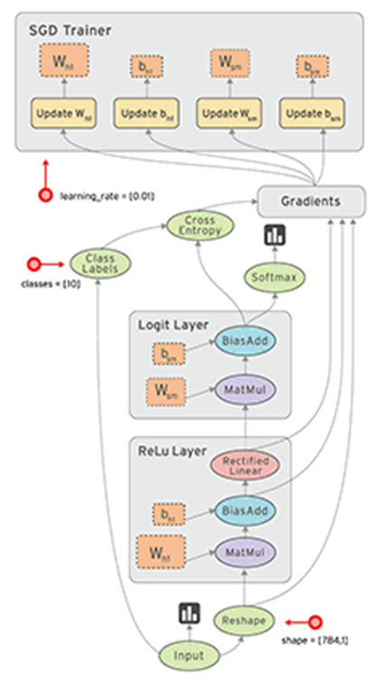
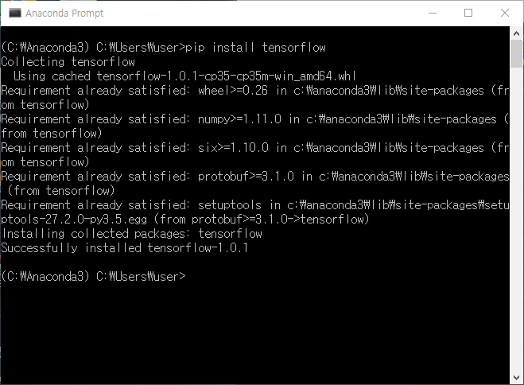
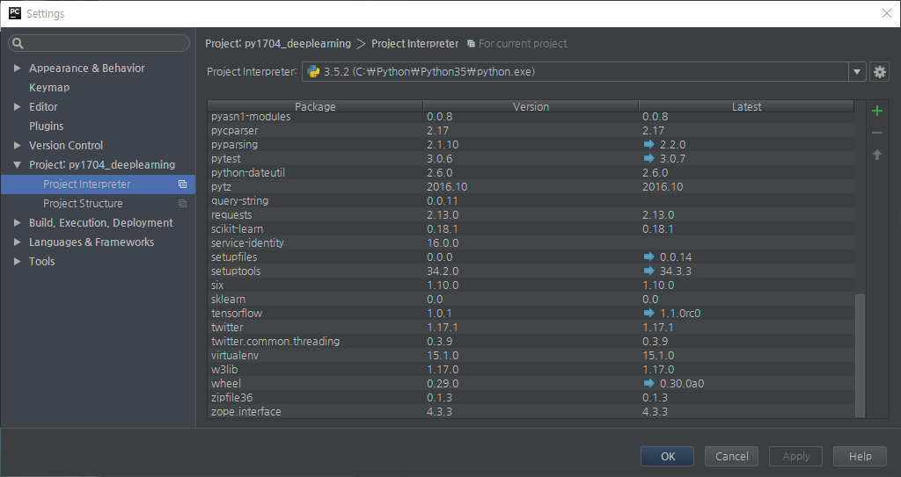
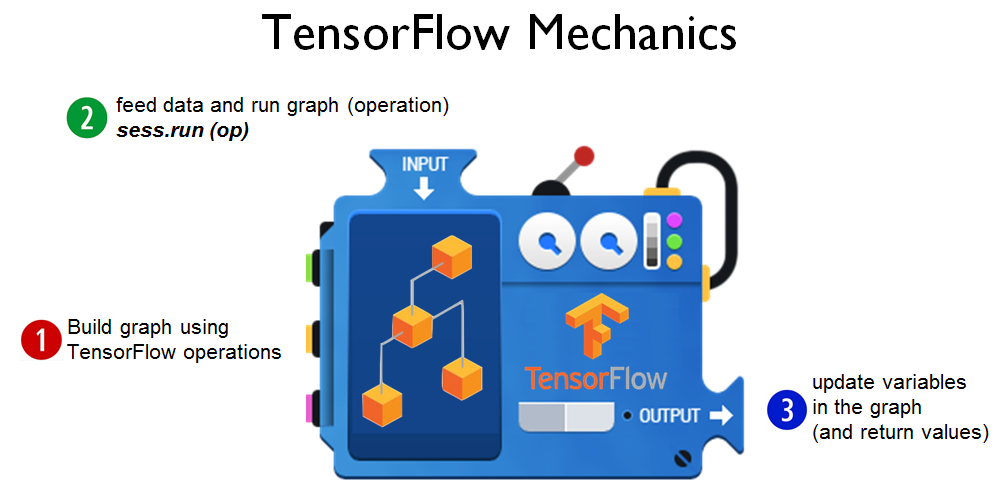
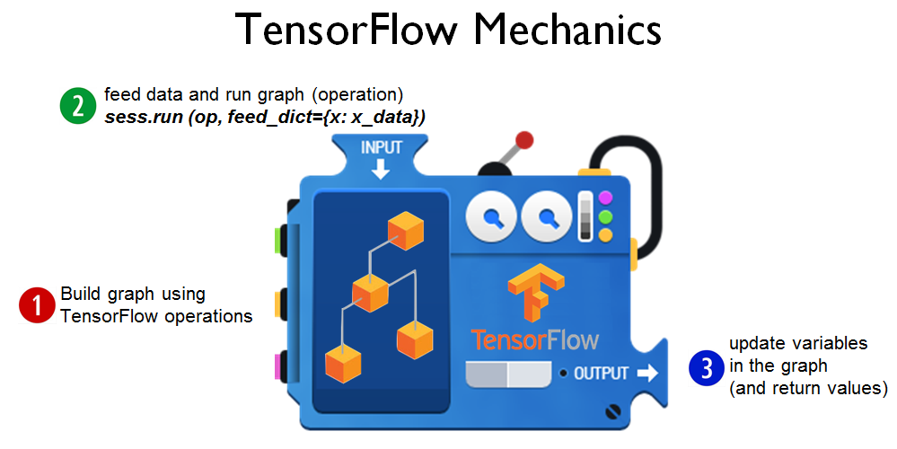

# Industry 4.0 의 중심, BigData

<div align='right'><font size=2 color='gray'>Data Processing Based Python @ <font color='blue'><a href='https://www.facebook.com/jskim.kr'>FB / jskim.kr</a></font>, [김진수](bigpycraft@gmail.com)</font></div>
<hr>

## Sect1. TensorFlow 개요
> 
<a href="https://www.tensorflow.org/get_started/get_started">Getting Started With TensorFlow</a>


```python
from images import bigpycraft_copy as bpc
```


```python
bpc.Figure(bpc.LOGO_TF_01, 200)
```


> 
- TensorFlow™ is an open source software library for numerical computation using data flow graphs.
- Python!

## Data Flow Graph
> 
- Nodes in the graph represent mathematical operations
- Edges represent the multidimensional data arrays (tensors) communicated between them. 
<!--

-->


```python
bpc.Figure(bpc.ML01_IMG_01, 200*1)
```





## Installing TensorFlow
> 
- Linux, Mac OS, Windows
  <br> <font color='brown'>(VirtualEnv) pip install tensorflow </font>
  <!--
  
  -->


```python
bpc.Figure(bpc.ML01_IMG_02, 500)
```





> 
- #### PyCharm
  <br> File &gt; settings... Ctrl+Alt+S
  <!--
  
  -->


```python
bpc.Figure(bpc.ML01_IMG_03, 500)
```





## Check TF version


```python
import tensorflow as tf
tf.__version__
```

    /Users/bigpycraft/anaconda3/lib/python3.6/site-packages/h5py/__init__.py:36: FutureWarning: Conversion of the second argument of issubdtype from `float` to `np.floating` is deprecated. In future, it will be treated as `np.float64 == np.dtype(float).type`.
      from ._conv import register_converters as _register_converters
    


    '1.9.0'


## Hello TensorFlow!


```python
# Create a constant op
# This op is added as a node to the default graph
hello = tf.constant("Hello, TensorFlow!")

# seart a TF session
sess = tf.Session()

```


```python
hello
```


    <tf.Tensor 'Const:0' shape=() dtype=string>


```python
# run the op and get result
sess.run(hello)
```


    b'Hello, TensorFlow!'


```python
result = sess.run(hello)
type(result)
```


    bytes


<font color='#cc0000'> [TIP] b 'String' </font>
> 
- 'b' indicates Bytes literals.
- 참조 : <a href="http://stackoverflow.com/questions/6269765/">What does the 'b' character do in front of a string literal?</a>


```python
type(hello)
```


    tensorflow.python.framework.ops.Tensor


```python
type(sess)
```


    tensorflow.python.client.session.Session


```python
# ? tf.constant
# Creates a constant tensor.
```

## Computational Graph


```python
# node1 = tf.constant(3.0, tf.float32)
node1 = tf.constant(3.0)
node2 = tf.constant(4.0)            # also tf.float32 implicitly
node3 = tf.add(node1, node2)
# node3 = node1 + node2
```


```python
print("node1 :", node1)
print("node2 :", node2)
print("node3 :", node3)
```

    node1 : Tensor("Const_1:0", shape=(), dtype=float32)
    node2 : Tensor("Const_2:0", shape=(), dtype=float32)
    node3 : Tensor("Add:0", shape=(), dtype=float32)
    


```python
sess = tf.Session()
print("sess.run(node1, node2)\t: ", sess.run([node1, node2, node3]))
print("sess.run(adder_node)  \t: ", sess.run(node3))
```

    sess.run(node1, node2)	:  [3.0, 4.0, 7.0]
    sess.run(adder_node)  	:  7.0
    


```python
type(node3)
```


    tensorflow.python.framework.ops.Tensor


```python
type(sess.run(node3))
```


    numpy.float32


### TensorFlow Mechanics
> 
1. 그래프 빌드
2. 세션을 통해 그래프를 실행
3. 실행결과가 그래프를 업데이트


```python
# TensorFlow Mechanism 이해
bpc.Figure(bpc.ML01_IMG_04)
```





### Placeholder


```python
a = tf.placeholder(tf.float32)
b = tf.placeholder(tf.float32)

# + provides a shortcut for tf.add(a, b)
adder_node = a + b  
```


```python
# TensorFlow Mechanism for placeholder
bpc.Figure(bpc.ML01_IMG_05)
```





```python
sess.run(adder_node, feed_dict={a: 3, b: 4.5})
```


    7.5


```python
sess.run(adder_node, feed_dict={a: [1,3], b: [2, 4]})
```


    array([3., 7.], dtype=float32)


```python
add_and_triple = adder_node * 3.
```


```python
sess.run(add_and_triple, feed_dict={a: 3, b:4.5})
```


    22.5


```python
import tensorflow as tf

# 변수 a, b는 동적으로 지정
# a = tf.placeholder("float32")
# b = tf.placeholder("float32")
a = tf.placeholder("int32")
b = tf.placeholder("int32")

# multiply 함수는 입력된 정수 a와 b의 곱셈을 반환한다.
y = tf.mul(a,b)

sess = tf.Session()

print("tf.mul({a},{b}) : {y}".format(
    a = 20, b = 30,
    y = sess.run(y , feed_dict={a: 20, b: 30})
))
```


    ---------------------------------------------------------------------------

    AttributeError                            Traceback (most recent call last)

    <ipython-input-26-50e8c4ecd424> in <module>()
          8 
          9 # multiply 함수는 입력된 정수 a와 b의 곱셈을 반환한다.
    ---> 10 y = tf.mul(a,b)
         11 
         12 sess = tf.Session()
    

    AttributeError: module 'tensorflow' has no attribute 'mul'


```python
? tf.mul
```

### Constant & Variable


```python
#first_session_only_tensorflow.py
import tensorflow as tf

x = tf.constant(100, name='x')
y = tf.Variable(x*2, name='y')

# model = tf.global_variables_initializer()
model = tf.initialize_all_variables()

with tf.Session() as sess:
    sess.run(model)
    print("constant x : {x} \nVariable y : {y}".format(
        x = sess.run(x), 
        y = sess.run(y)
    ))
```


```python
#first_session_only_tensorflow.py
import tensorflow as tf

x = tf.constant(100, name='x')
y = tf.Variable(x*2, name='y')

# model = tf.global_variables_initializer()
model = tf.initialize_all_variables()

with tf.Session() as sess:
    sess.run(model)
    print("Check the variable : \n- constant x : {x} \n- Variable y : {y}".format(
        x = sess.run(x), 
        y = sess.run(y)
    ))
```

###  Everything is Tensor

> 
- Tensor Ranks, Shapes, and Types
- n차원 Array == n차원 Tensor


```python
# TensorFlow : Math entity
bpc.Figure(bpc.ML01_IMG_06, 800)
```


```python
# TensorFlow : Shape, Dimension
bpc.Figure(bpc.ML01_IMG_07, 800)
```
# a rank 0 tensor; this is a scalar with shape []
3 
# a rank 1 tensor; this is a vector with shape [3]
[1. ,2., 3.]
# a rank 2 tensor; a matrix with shape [2, 3]
[[1., 2., 3.], 
 [4., 5., 6.]] 
# a rank 3 tensor with shape [2, 1, 3]
[[[1., 2., 3.]], 
 [[7., 8., 9.]]] 

```python
rank0 = 3
rank0
```


```python
rank1 = [1. ,2., 3.]
rank1
```


```python
rank2 = [[1., 2., 3.], 
         [4., 5., 6.]]
rank2
```


```python
rank3 = [
            [
                [1., 2., 3.]
            ], 
            [
                [7., 8., 9.]
            ]
] 
rank3
```

##  텐서플로우 연산


```python
import tensorflow as tf 
import numpy as np

tensor_1d = np.array([1.2, 3.4, 5.6, 7.8])
tensor_2d = np.arange(16).reshape((4,4))
tensor_2d
```


```python
sess = tf.Session()
tf_tensor_1d = tf.convert_to_tensor(tensor_1d,dtype=tf.float64)
tf_tensor_2d = tf.convert_to_tensor(tensor_2d,dtype=tf.float64)
```


```python
sess.run(tf_tensor_1d)
```


```python
sess.run(tf_tensor_1d[0])
```


```python
sess.run(tf_tensor_1d[2:])
```


```python
sess.run(tf_tensor_2d)
```


```python
#sess.run(tf_tensor_2d[3][3])
sess.run(tf_tensor_2d[3, 3])
```


```python
sess.run(tf_tensor_2d[1:3, 1:3])
```


```python
import tensorflow as tf
import numpy as np

# 3x3 행렬
matrix1 = np.array([(1, 1, 1), (1, 1, 1), (1, 1, 1)])
matrix2 = np.array([(2, 2, 2), (2, 2, 2), (2, 2, 2)])

# constant, 텐서 자료 구조로 변환
# matrix1 = tf.constant(matrix1)
# matrix2 = tf.constant(matrix2)
matrix1 = tf.constant(matrix1, dtype='int32')
matrix2 = tf.constant(matrix2, dtype='int32')

# 행렬곱과 행렬합 계산
matrix_mul = tf.matmul(matrix1, matrix2)
matrix_sum = tf.add(matrix1, matrix2)

# 행렬의 행렬식(determinant)
matrix3 = np.array([(2, 7, 2), (1, 4, 2), (9, 0, 2)], dtype='float32')
print('matrix3 = {}'.format(matrix3))

matrix_dtm = tf.matrix_determinant(matrix3)
print('matrix_dtm = {}'.format(matrix_dtm))

# 세션을 열고 그래프 연산
with tf.Session() as sess:
    result1 = sess.run(matrix_mul)
    result2 = sess.run(matrix_sum)
    result3 = sess.run(matrix_dtm)
    
    # tensorboard for graph
    # writer = tf.summary.FileWriter("./graph/sect01", sess.graph)

# 연산 결과 출력
print('matrix_mul = {}'.format(result1))
print('matrix_sum = {}'.format(result2))
print('matrix_dtm = {}'.format(result3))

```


```python
import tensorflow as tf
import numpy as np

# 3x3 행렬
matrix1 = np.array([(1, 1, 1), (1, 1, 1), (1, 1, 1)])
matrix2 = np.array([(2, 2, 2), (2, 2, 2), (2, 2, 2)])

# constant, 텐서 자료 구조로 변환
# matrix1 = tf.constant(matrix1)
# matrix2 = tf.constant(matrix2)
matrix1 = tf.constant(matrix1, dtype='int32')
matrix2 = tf.constant(matrix2, dtype='int32')

# 행렬곱과 행렬합 계산
matrix_mul = tf.matmul(matrix1, matrix2)
matrix_sum = tf.add(matrix1, matrix2)

# 행렬의 행렬식(determinant)
matrix3 = np.array([(2, 7, 2), (1, 4, 2), (9, 0, 2)], dtype='float32')
print('matrix3 = {}'.format(matrix3))

matrix_dtm = tf.matrix_determinant(matrix3)
print('matrix_dtm = {}'.format(matrix_dtm))


```


```python
# 세션을 열고 그래프 연산
with tf.Session() as sess:
    result1 = sess.run(matrix_mul)
    result2 = sess.run(matrix_sum)
    result3 = sess.run(matrix_dtm)
    
    # tensorboard for graph
    # writer = tf.summary.FileWriter("./graph/sect01", sess.graph)

# 연산 결과 출력
print('matrix_mul = {}'.format(result1))
print('matrix_sum = {}'.format(result2))
print('matrix_dtm = {}'.format(result3))

```


```python
% pwd
```
<!--
(C:\Python\Anaconda3-44) > tensorboard --logdir=graph/sect01 --host=localhost --port=9999
-->
<hr>
<marquee><font size=3 color='brown'>The BigpyCraft find the information to design valuable society with Technology & Craft.</font></marquee>
<div align='right'><font size=2 color='gray'> &lt; The End &gt; </font></div>
