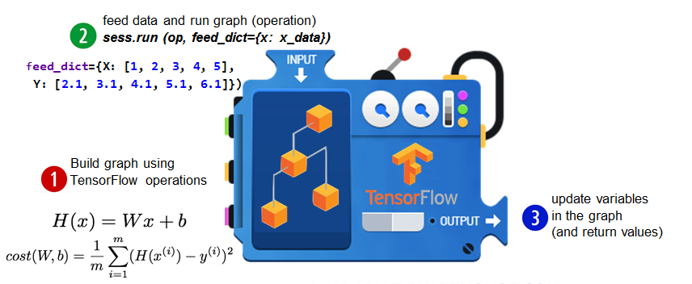
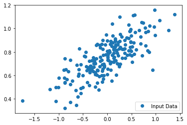
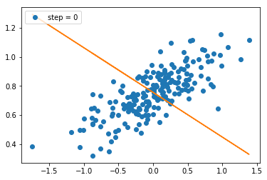
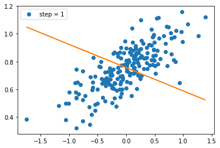
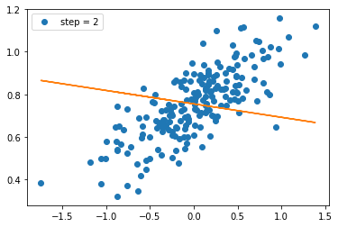
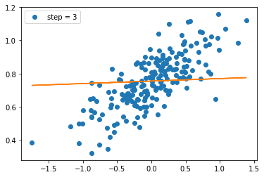
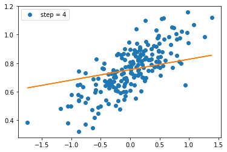
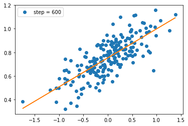

# Industry 4.0 의 중심, BigData

<div align='right'><font size=2 color='gray'>Data Processing Based Python @ <font color='blue'><a href='https://www.facebook.com/jskim.kr'>FB / jskim.kr</a></font>, [김진수](bigpycraft@gmail.com)</font></div>
<hr>

## Sect2. Linear Regression


```python
from images import bigpycraft_copy as bpc
```
<!--
## Hypothesis

$$H(x) = Wx+b$$
$$H(x_1,x_2) = w_1x_1 + w_2x_2 + b$$
$$H(x_1,...,x_n) = w_1x_1 + ... + w_nx_n + b$$

$$cost(W,b) = \frac{1}{m} \sum^m_{i=1}(H(x^{(i)}-y^{(i)})^2$$

$$
[w1 w2 w3] \times
\begin{bmatrix}
    x_{1}\\
    x_{2}\\
    x_{3}
\end{bmatrix}
=
[w_1\times x_1 + w_2 \times x_2 + w_3 \times x_3 + b]
$$

$$H(X) = WX + b$$

$$
[b w1 w2 w3] \times
\begin{bmatrix}
    1\\
    x_{1}\\
    x_{2}\\
    x_{3}
\end{bmatrix}
=
[b \times 1 + w_1\times x_1 + w_2 \times x_2 + w_3 \times x_3]
$$

$$H(X) = WX$$

$$
\begin{bmatrix}
    b\\
    w_{1}\\
    w_{2}\\
    w_{3}
\end{bmatrix}
\times
\begin{bmatrix}
    1\\
    x_{1}\\
    x_{2}\\
    x_{3}
\end{bmatrix}
\neq [b w1 w2 w3] \times
\begin{bmatrix}
    1\\
    x_{1}\\
    x_{2}\\
    x_{3}
\end{bmatrix}
$$

### Transpose

$$
\begin{bmatrix}
    w_{1} && w_{4}\\
    w_{2} && w_{5}\\
    w_{3} && w_{6}
\end{bmatrix}^T
=
\begin{bmatrix}
    w_{1} && w_{2} && w_{3}\\
    w_{4} && w_{5} && w_{6}
\end{bmatrix}
$$

어떨 때 우리는 $$H(X) = W^T X$$를 사용하기도 한다.
//-->
### Hypothesis and cost function
$$H(x) = Wx+b$$
$$cost(W,b) = \frac{1}{m} \sum^m_{i=1}(H(x^{(i)}-y^{(i)})^2$$
$$H(x) = Wx+b$$
$$cost(W,b) = \frac{1}{m} \sum^m_{i=1}(H(x^{(i)}-y^{(i)})^2$$

### TensorFlow Mechanics
> 
1. Build graph using TF operations
2. Run graph and get results
3. Update graph and get results


```python
# TensorFlow Mechanics
bpc.Figure(bpc.ML02_IMG_01)
```


### Ex1. Variable 사용
> $$H(x) = Wx+b$$
x, y 값이 주어졌을 때, W, b 값을 예측하기
<br>
1. 그래프 빌드
2. 세션을 통해 그래프를 실행
3. 실행결과가 그래프를 업데이트


```python
from tqdm import tqdm_notebook
import tensorflow as tf

# X and Y data
x_train = [1, 2, 3]
y_train = [1, 2, 3]

# TF 변수 선언 (1차원 랜던숫자)
W = tf.Variable(tf.random_normal([1]), name='weight')
b = tf.Variable(tf.random_normal([1]), name='bias')

# Our hypothesis XW+b
hypothesis = x_train * W + b

# cost/loss function
cost = tf.reduce_mean(tf.square(hypothesis - y_train))

# Minimize
optimizer = tf.train.GradientDescentOptimizer(learning_rate=0.01)
train = optimizer.minimize(cost)

# Launch the graph in a session.
sess = tf.Session()
# Initializes global variables in the graph.
# sess.run(tf.initialize_all_variables())
sess.run(tf.global_variables_initializer())

```

    /Users/bigpycraft/anaconda3/lib/python3.6/site-packages/h5py/__init__.py:36: FutureWarning: Conversion of the second argument of issubdtype from `float` to `np.floating` is deprecated. In future, it will be treated as `np.float64 == np.dtype(float).type`.
      from ._conv import register_converters as _register_converters
    
<!--
# Fit the line
for step in range(2001):
    sess.run(train)
    if step % 20 == 0:
        print(step, sess.run(cost), sess.run(W), sess.run(b))
//-->

```python
# Fit the line
for step in tqdm_notebook(range(2001)):
    sess.run(train)
    if step % 200 == 0 or step < 5:
        # print(step, cost_val, W_val, b_val)
        print("step={step}, \t cost={cost_val},  \t W={W_val},  \t b={b_val}".format(
            step=step, 
            cost_val=sess.run(cost), 
            W_val=sess.run(W), 
            b_val=sess.run(b)
        ));

```


    HBox(children=(IntProgress(value=0, max=2001), HTML(value='')))


    step=0, 	 cost=16.31488609313965,  	 W=[-0.58030665],  	 b=[-0.66691524]
    step=1, 	 cost=12.896063804626465,  	 W=[-0.40613475],  	 b=[-0.5903647]
    step=2, 	 cost=10.193663597106934,  	 W=[-0.2512809],  	 b=[-0.522312]
    step=3, 	 cost=8.057562828063965,  	 W=[-0.11360221],  	 b=[-0.46181452]
    step=4, 	 cost=6.369088649749756,  	 W=[0.00880658],  	 b=[-0.40803415]
    step=200, 	 cost=3.072091203648597e-05,  	 W=[0.9935626],  	 b=[0.01463382]
    step=400, 	 cost=1.1730789083230775e-05,  	 W=[0.9960221],  	 b=[0.00904271]
    step=600, 	 cost=4.479235940380022e-06,  	 W=[0.9975419],  	 b=[0.00558784]
    step=800, 	 cost=1.7106417544709984e-06,  	 W=[0.998481],  	 b=[0.00345308]
    step=1000, 	 cost=6.533011855935911e-07,  	 W=[0.9990613],  	 b=[0.0021339]
    step=1200, 	 cost=2.4958595190582855e-07,  	 W=[0.99941975],  	 b=[0.00131894]
    step=1400, 	 cost=9.53588141783257e-08,  	 W=[0.99964136],  	 b=[0.00081533]
    step=1600, 	 cost=3.648493063224123e-08,  	 W=[0.99977803],  	 b=[0.00050431]
    step=1800, 	 cost=1.3977991208946605e-08,  	 W=[0.99986273],  	 b=[0.00031213]
    step=2000, 	 cost=5.354763743525837e-09,  	 W=[0.99991494],  	 b=[0.00019325]
    
    

### Ex2. Plaeholder 사용
> 
데이터의 형태만 지정하고 실제 데이터는 실행단계에서 입력받는 방법
<br>
1. 그래프 빌드
2. 세션을 통해 그래프를 실행
3. 실행결과가 그래프를 업데이트


```python
import tensorflow as tf

W = tf.Variable(tf.random_normal([1]), name='weight')
b = tf.Variable(tf.random_normal([1]), name='bias')

X = tf.placeholder(tf.float32, shape=[None])
Y = tf.placeholder(tf.float32, shape=[None])

# Our hypothesis XW+b
hypothesis = X * W + b
# cost/loss function
cost = tf.reduce_mean(tf.square(hypothesis - Y))
# Minimize
optimizer = tf.train.GradientDescentOptimizer(learning_rate=0.01)
train = optimizer.minimize(cost)

# Launch the graph in a session.
sess = tf.Session()
# Initializes global variables in the graph.
# sess.run(tf.initialize_all_variables())
sess.run(tf.global_variables_initializer())

```


```python
# ? tf.random_normal
# Signature: tf.random_normal(shape, mean=0.0, stddev=1.0, dtype=tf.float32, seed=None, name=None)
# Docstring:
# Outputs random values from a normal distribution.

```


```python
# Fit the line
steps     = []
cost_vals = []
W_vals    = []
b_vals    = []
for step in tqdm_notebook(range(2001)):
    cost_val, W_val, b_val, _ = sess.run([cost, W, b, train],
                                         feed_dict={X: [1, 2, 3], 
                                                    Y: [1, 2, 3]})
    steps.append(step)
    cost_vals.append(cost_val)
    W_vals.append(W_val)
    b_vals.append(b_val)
    # W_vals.append(float(W_val))
    # b_vals.append(float(b_val))
    
    if step % 200 == 0 or step < 5:
        # print(step, cost_val, W_val, b_val)
        print("step={step}, \t cost={cost_val}, \t W={W_val}, \t b={b_val}".format(
            step=step, cost_val=cost_val, W_val=W_val, b_val=b_val
            ));
```


    HBox(children=(IntProgress(value=0, max=2001), HTML(value='')))


    step=0, 	 cost=2.1901769638061523, 	 W=[0.38476822], 	 b=[0.01368396]
    step=1, 	 cost=1.7328928709030151, 	 W=[0.4416425], 	 b=[0.03801955]
    step=2, 	 cost=1.3714261054992676, 	 W=[0.49223506], 	 b=[0.05959346]
    step=3, 	 cost=1.0856980085372925, 	 W=[0.5372427], 	 b=[0.07871219]
    step=4, 	 cost=0.8598370552062988, 	 W=[0.5772849], 	 b=[0.09564824]
    step=200, 	 cost=0.003123765578493476, 	 W=[0.93524253], 	 b=[0.14720893]
    step=400, 	 cost=0.0011928114108741283, 	 W=[0.9599838], 	 b=[0.09096622]
    step=600, 	 cost=0.00045547084300778806, 	 W=[0.9752725], 	 b=[0.05621155]
    step=800, 	 cost=0.00017392169684171677, 	 W=[0.9847199], 	 b=[0.03473526]
    step=1000, 	 cost=6.641221261816099e-05, 	 W=[0.99055785], 	 b=[0.02146437]
    step=1200, 	 cost=2.5358427592436783e-05, 	 W=[0.9941653], 	 b=[0.0132636]
    step=1400, 	 cost=9.68344829743728e-06, 	 W=[0.9963945], 	 b=[0.00819613]
    step=1600, 	 cost=3.6977742183808004e-06, 	 W=[0.99777204], 	 b=[0.0050647]
    step=1800, 	 cost=1.4119017350822105e-06, 	 W=[0.9986232], 	 b=[0.00312981]
    step=2000, 	 cost=5.392166713136248e-07, 	 W=[0.9991491], 	 b=[0.00193421]
    
    


```python
W_val, W_val[0], type(W_val[0])
```


    (array([0.9991491], dtype=float32), 0.9991491, numpy.float32)


```python
# cost_vals, b_val
type(b_val), str(b_val), float(b_val)
```


    (numpy.ndarray, '[0.00193421]', 0.001934207510203123)


### Ex3. Plaeholder 사용
> 
- X: [1.0, 2.0, 3.0, 4.0, 5.0]
- Y: [2.1, 3.1, 4.1, 5.1, 6.1]
- W=1, b=1.1


```python
# TensorFlow Mechanism for placeholder
bpc.Figure(bpc.ML02_IMG_02)
```





```python
# Fit the line
for step in range(2001):
    cost_val, W_val, b_val, _ = sess.run([cost, W, b, train],
        feed_dict={X: [1.0, 2.0, 3.0, 4.0, 5.0], 
                   Y: [2.1, 3.1, 4.1, 5.1, 6.1]})
    if step % 100 == 0 or step < 10:
        # print(step, cost_val, W_val, b_val)
        print("step={step}, \t cost={cost_val}, \t W={W_val},  \t b={b_val}".format(
            step=step, cost_val=cost_val, W_val=W_val, b_val=b_val
            ));
        
```

    step=0, 	 cost=1.2113622426986694, 	 W=[1.0652202],  	 b=[0.02394657]
    step=1, 	 cost=0.7835984826087952, 	 W=[1.115435],  	 b=[0.04155442]
    step=2, 	 cost=0.5337944626808167, 	 W=[1.153546],  	 b=[0.05579723]
    step=3, 	 cost=0.38770052790641785, 	 W=[1.182418],  	 b=[0.06746853]
    step=4, 	 cost=0.3020467162132263, 	 W=[1.2042379],  	 b=[0.07717407]
    step=5, 	 cost=0.25161808729171753, 	 W=[1.2206751],  	 b=[0.08537631]
    step=6, 	 cost=0.22172054648399353, 	 W=[1.233004],  	 b=[0.09242828]
    step=7, 	 cost=0.2037908285856247, 	 W=[1.2421974],  	 b=[0.09859948]
    step=8, 	 cost=0.19283877313137054, 	 W=[1.248998],  	 b=[0.10409565]
    step=9, 	 cost=0.18595628440380096, 	 W=[1.2539728],  	 b=[0.10907385]
    step=100, 	 cost=0.09611991047859192, 	 W=[1.2006013],  	 b=[0.37576523]
    step=200, 	 cost=0.04882578179240227, 	 W=[1.1429724],  	 b=[0.58382446]
    step=300, 	 cost=0.024801913648843765, 	 W=[1.1018989],  	 b=[0.73211217]
    step=400, 	 cost=0.012598568573594093, 	 W=[1.0726252],  	 b=[0.83779967]
    step=500, 	 cost=0.00639964547008276, 	 W=[1.0517614],  	 b=[0.9131253]
    step=600, 	 cost=0.0032508212607353926, 	 W=[1.0368912],  	 b=[0.9668108]
    step=700, 	 cost=0.001651320606470108, 	 W=[1.0262932],  	 b=[1.0050734]
    step=800, 	 cost=0.0008388202404603362, 	 W=[1.0187396],  	 b=[1.0323437]
    step=900, 	 cost=0.00042609553202055395, 	 W=[1.0133562],  	 b=[1.05178]
    step=1000, 	 cost=0.00021644758817274123, 	 W=[1.0095191],  	 b=[1.0656325]
    step=1100, 	 cost=0.00010994523472618312, 	 W=[1.0067844],  	 b=[1.0755059]
    step=1200, 	 cost=5.584873724728823e-05, 	 W=[1.0048354],  	 b=[1.0825425]
    step=1300, 	 cost=2.8369977371767163e-05, 	 W=[1.0034463],  	 b=[1.0875576]
    step=1400, 	 cost=1.4411494703381322e-05, 	 W=[1.0024563],  	 b=[1.0911318]
    step=1500, 	 cost=7.321190878428752e-06, 	 W=[1.0017508],  	 b=[1.0936792]
    step=1600, 	 cost=3.719638698385097e-06, 	 W=[1.001248],  	 b=[1.0954945]
    step=1700, 	 cost=1.8899196447819122e-06, 	 W=[1.0008895],  	 b=[1.0967886]
    step=1800, 	 cost=9.600473731552484e-07, 	 W=[1.0006341],  	 b=[1.097711]
    step=1900, 	 cost=4.878638151240011e-07, 	 W=[1.000452],  	 b=[1.0983683]
    step=2000, 	 cost=2.47953067855633e-07, 	 W=[1.0003222],  	 b=[1.0988368]
    

### Ex4. Linear Regression


```python
import numpy as np
import matplotlib.pyplot as plt
import tensorflow as tf

number_of_points = 200
x_point = []
y_point = []

w = 0.25
b = 0.75

for i in range(number_of_points):
    x = np.random.normal(0.0, 0.5)
    y = w*x + b +np.random.normal(0.0, 0.1)
    x_point.append([x])
    y_point.append([y])
```


```python
plt.plot(x_point,y_point, 'o', label='Input Data')
plt.legend(loc=4)
plt.show()
```





```python
W = tf.Variable(tf.random_uniform([1], -1.0, 1.0))
B = tf.Variable(tf.zeros([1]))
y = W * x_point + B

# Computes the mean of elements across dimensions of a tensor
cost_function = tf.reduce_mean(tf.square(y - y_point))

# Optimizer that implements the gradient descent algorithm
optimizer = tf.train.GradientDescentOptimizer(learning_rate=0.5)

# Add operations to minimize cost_function
train = optimizer.minimize(cost_function)

# Returns an Op that initializes global variables
# model = tf.initialize_all_variables()
model = tf.global_variables_initializer()

```


```python
with tf.Session() as sess:
    sess.run(model)
    for step in range(0,2001):
        sess.run(train)
        if (step % 200) == 0 or step<5:
            print("\n y = {w} x + {b} ".format(w=sess.run(W), b=sess.run(B)))
            plt.plot(x_point,y_point,'o',label='step = {}'.format(step))
            plt.plot(x_point,sess.run(W)*x_point+sess.run(B))
            plt.legend(loc=2)
            plt.show()
```

    
     y = [-0.30699527] x + [0.75645167] 
    





    
     y = [-0.16729397] x + [0.75569004] 
    





    
     y = [-0.06296669] x + [0.75513333] 
    





    
     y = [0.01494364] x + [0.7547175] 
    





    
     y = [0.07312612] x + [0.75440705] 
    





    
     y = [0.24472111] x + [0.7534913] 
    


    
     y = [0.24472111] x + [0.7534913] 
    


    
     y = [0.24472111] x + [0.7534913] 
    





    
     y = [0.24472111] x + [0.7534913] 
    


    
     y = [0.24472111] x + [0.7534913] 
    


    
     y = [0.24472111] x + [0.7534913] 
    


    
     y = [0.24472111] x + [0.7534913] 
    


    
     y = [0.24472111] x + [0.7534913] 
    


    
     y = [0.24472111] x + [0.7534913] 
    


    
     y = [0.24472111] x + [0.7534913] 
    


<hr>
<marquee><font size=3 color='brown'>The BigpyCraft find the information to design valuable society with Technology & Craft.</font></marquee>
<div align='right'><font size=2 color='gray'> &lt; The End &gt; </font></div>
