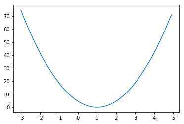
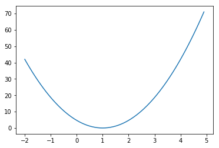
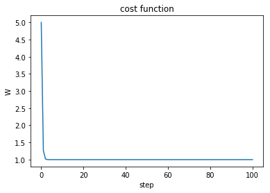
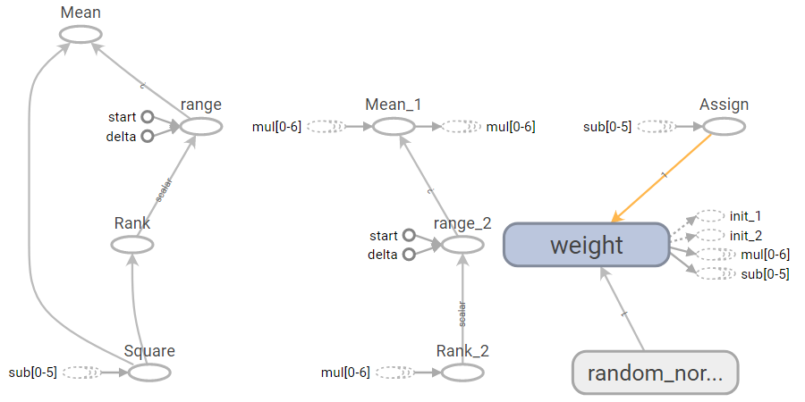
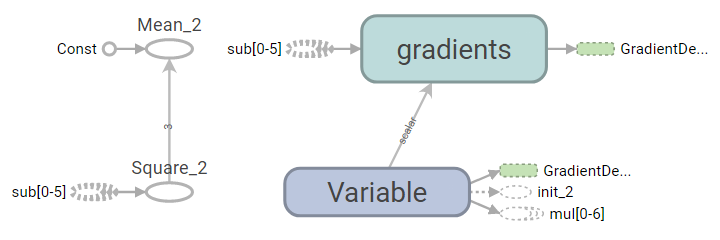
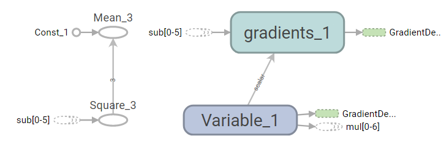
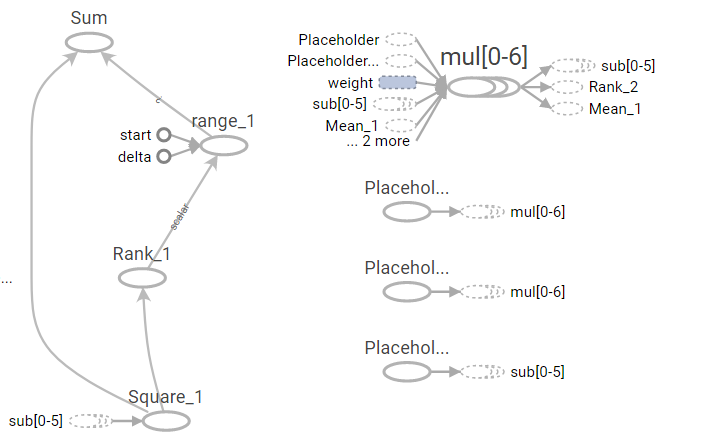
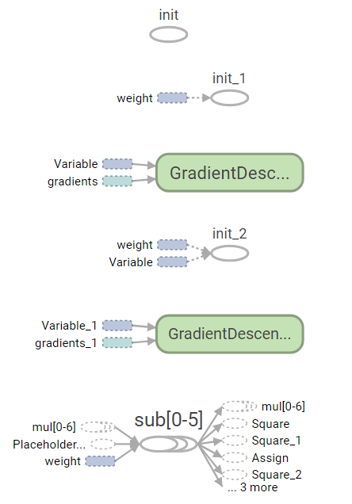

# Industry 4.0 의 중심, BigData

<div align='right'><font size=2 color='gray'>Data Processing Based Python @ <font color='blue'><a href='https://www.facebook.com/jskim.kr'>FB / jskim.kr</a></font>, [김진수](bigpycraft@gmail.com)</font></div>
<hr>

## Sect3. Cost 최소화기법, How to minimize cost

## <font color='brown'> Cost minimize 1 </font>
<!-- lab03_minimize01.py -->

## 간단한 가설, Linear Model

### Our hypothesis for linear model X * W
> hypothesis = X * W
<br><br><br>
$$H(x) = Wx$$

### cost/loss function
> cost = tf.reduce_mean(tf.square(hypothesis - Y))
<br><br><br>
$$cost(W) = \frac{1}{m} \sum^m_{i=1}(H(x^{(i)}-y^{(i)})^2$$


```python
from images import bigpycraft_copy as bpc
```


```python
import tensorflow as tf
import matplotlib.pyplot as plt

X = [1, 2, 3]
Y = [1, 2, 3]

W = tf.placeholder(tf.float32)

# Our hypothesis for linear model X * W
hypothesis = X * W

# cost/loss function
cost = tf.reduce_mean(tf.square(hypothesis - Y))

# Launch the graph in a session.
sess = tf.Session()

# Initializes global variables in the graph.
sess.run(tf.global_variables_initializer())

# Variables for plotting cost function
W_val = []
cost_val = []
for i in range(-30, 50):
    feed_W = i * 0.1
    curr_cost, curr_W = sess.run([cost, W], feed_dict={W: feed_W})
    W_val.append(curr_W)
    cost_val.append(curr_cost)

# Show the cost function
plt.plot(W_val, cost_val)
plt.show()

```





```python
# Variables for plotting cost function
W_val = []
cost_val = []
for i in range(-20, 50):
    feed_W = i * 0.1
    curr_cost, curr_W = sess.run([cost, W], feed_dict={W: feed_W})
    W_val.append(curr_W)
    cost_val.append(curr_cost)

# Show the cost function
plt.plot(W_val, cost_val)
plt.show()
```




<!--
# ? tf.train.GradientDescentOptimizer(learning_rate=0.1)
'''
Init signature: tf.train.GradientDescentOptimizer(learning_rate, use_locking=False, name='GradientDescent')
Docstring:     
Optimizer that implements the gradient descent algorithm.
  
Init docstring:
Construct a new gradient descent optimizer.

Args:
  learning_rate: A Tensor or a floating point value.  The learning
    rate to use.
  use_locking: If True use locks for update operations.
  name: Optional name prefix for the operations created when applying
    gradients. Defaults to "GradientDescent".
''' 
--><!--
# ? optimizer.minimize(cost)
'''
Signature: optimizer.minimize(loss, global_step=None, var_list=None, gate_gradients=1, aggregation_method=None, colocate_gradients_with_ops=False, name=None, grad_loss=None)
Docstring:
Add operations to minimize `loss` by updating `var_list`.

This method simply combines calls `compute_gradients()` and
`apply_gradients()`. If you want to process the gradient before applying
them call `compute_gradients()` and `apply_gradients()` explicitly instead
of using this function.
'''
-->
## <font color='brown'> Cost minimize 2 </font>
<!-- lab03_minimize02.py -->

## Gradient descent

$$cost(W) = \frac{1}{m} \sum^m_{i=1}(H(x^{(i)}-y^{(i)})^2$$

$$W := W - a\frac{1}{m} \sum^m_{i=1}(Wx^{(i)}-y^{(i)})x^{(i)}$$
<!--
# Minimize: Gradient Descent using derivative: W -= learning_rate * derivative
learning_rate = 0.1
gradient = tf.reduce_mean((W * X - Y) * X)
descent = W - learning_rate * gradient
update = W.assign(descent)
//-->

```python
import tensorflow as tf

x_data = [1, 2, 3]
y_data = [1, 2, 3]

W = tf.Variable(tf.random_normal([1]), name='weight')
X = tf.placeholder(tf.float32)
Y = tf.placeholder(tf.float32)

# Our hypothesis for linear model X * W
hypothesis = X * W

# cost/loss function
cost = tf.reduce_sum(tf.square(hypothesis - Y))

# Minimize: Gradient Descent using derivative: W -= learning_rate * derivative
learning_rate = 0.1
gradient = tf.reduce_mean((W * X - Y) * X)
descent = W - learning_rate * gradient
update = W.assign(descent)

# Launch the graph in a session.
sess = tf.Session()

# Initializes global variables in the graph.
sess.run(tf.global_variables_initializer())

for step in range(21):
    sess.run(update, feed_dict={X: x_data, Y: y_data})
    # print(step, sess.run(cost, feed_dict={X: x_data, Y: y_data}), sess.run(W))    
    print("step={step},   \t sess_cost={sess_cost},    \t W={sess_W}".format(
            step=step, 
            sess_cost=sess.run(cost, feed_dict={X: x_data, Y: y_data}), 
            sess_W=sess.run(W)
            ));

```

    step=0,   	 sess_cost=0.2893088757991791,    	 W=[ 0.85624701]
    step=1,   	 sess_cost=0.08229231834411621,    	 W=[ 0.92333174]
    step=2,   	 sess_cost=0.0234075915068388,    	 W=[ 0.95911026]
    step=3,   	 sess_cost=0.006658144295215607,    	 W=[ 0.97819215]
    step=4,   	 sess_cost=0.0018938720459118485,    	 W=[ 0.98836917]
    step=5,   	 sess_cost=0.0005386986886151135,    	 W=[ 0.99379689]
    step=6,   	 sess_cost=0.00015323424304369837,    	 W=[ 0.99669164]
    step=7,   	 sess_cost=4.358663863968104e-05,    	 W=[ 0.99823552]
    step=8,   	 sess_cost=1.2397738828440197e-05,    	 W=[ 0.99905896]
    step=9,   	 sess_cost=3.526244427121128e-06,    	 W=[ 0.99949813]
    step=10,   	 sess_cost=1.0030738621935598e-06,    	 W=[ 0.99973232]
    step=11,   	 sess_cost=2.8524732442747336e-07,    	 W=[ 0.99985725]
    step=12,   	 sess_cost=8.113640603824024e-08,    	 W=[ 0.99992388]
    step=13,   	 sess_cost=2.3081060618324045e-08,    	 W=[ 0.99995941]
    step=14,   	 sess_cost=6.546191144707336e-09,    	 W=[ 0.99997836]
    step=15,   	 sess_cost=1.880223976513662e-09,    	 W=[ 0.99998844]
    step=16,   	 sess_cost=5.254783275177033e-10,    	 W=[ 0.99999386]
    step=17,   	 sess_cost=1.4928858149687585e-10,    	 W=[ 0.99999672]
    step=18,   	 sess_cost=4.2451375747987186e-11,    	 W=[ 0.99999827]
    step=19,   	 sess_cost=1.0874856570808333e-11,    	 W=[ 0.99999911]
    step=20,   	 sess_cost=3.183231456205249e-12,    	 W=[ 0.99999952]
    

## <font color='brown'> Cost minimize 3 </font>
<!-- lab03_minimize03.py -->


```python
import tensorflow as tf

# tf Graph Input
X = [1, 2, 3]
Y = [1, 2, 3]

# Set wrong model weights
W = tf.Variable(5.0)

# Linear model
hypothesis = X * W

# cost/loss function
cost = tf.reduce_mean(tf.square(hypothesis - Y))

# Minimize: Gradient Descent Magic
optimizer = tf.train.GradientDescentOptimizer(learning_rate=0.1)
train = optimizer.minimize(cost)

# Launch the graph in a session.
sess = tf.Session()

```


```python
# Initializes global variables in the graph.
sess.run(tf.global_variables_initializer())

W_val = []
step_val = []

for step in range(101):
    W_val.append(sess.run(W))
    step_val.append(step)
    
    if step % 10 == 0 or step < 10:
        # print(step, sess.run(W))
        print("step={step}, \t W={W_val}".format(
            step=step, W_val=sess.run(W)
            )); 
                
    sess.run(train)
    
```

    step=0, 	 W=5.0
    step=1, 	 W=1.2666664123535156
    step=2, 	 W=1.0177778005599976
    step=3, 	 W=1.0011851787567139
    step=4, 	 W=1.0000790357589722
    step=5, 	 W=1.0000052452087402
    step=6, 	 W=1.0000003576278687
    step=7, 	 W=1.0
    step=8, 	 W=1.0
    step=9, 	 W=1.0
    step=10, 	 W=1.0
    step=20, 	 W=1.0
    step=30, 	 W=1.0
    step=40, 	 W=1.0
    step=50, 	 W=1.0
    step=60, 	 W=1.0
    step=70, 	 W=1.0
    step=80, 	 W=1.0
    step=90, 	 W=1.0
    step=100, 	 W=1.0
    


```python
# Show the cost function
plt.plot(step_val, W_val)
plt.title('cost function')
plt.xlabel('step')
plt.ylabel('W')
plt.show()
```





```python
type(train)
```


    tensorflow.python.framework.ops.Operation


```python
# lab03_minimize03.py
import tensorflow as tf

# tf Graph Input
X = [1, 2, 3]
Y = [2, 4, 6]

# Set wrong model weights
W = tf.Variable(-7.0)

# Linear model
hypothesis = X * W

# cost/loss function
cost = tf.reduce_mean(tf.square(hypothesis - Y))

# Minimize: Gradient Descent Magic
optimizer = tf.train.GradientDescentOptimizer(learning_rate=0.1)
train = optimizer.minimize(cost)

# Launch the graph in a session.
sess = tf.Session()

# tensorboard for graph
writer = tf.summary.FileWriter("./graph/sect03", sess.graph)

```


```python
sess.graph
```


    <tensorflow.python.framework.ops.Graph at 0x20d15c84358>


<!--
(Anaconda 3) > tensorboard --logdir=graph/sect03 --port=9999
-->

```python
bpc.Figure(bpc.ML03_IMG_01)
```





```python
bpc.Figure(bpc.ML03_IMG_02)
```





```python
bpc.Figure(bpc.ML03_IMG_03)
```





```python
bpc.Figure(bpc.ML03_IMG_04)
```





```python
bpc.Figure(bpc.ML03_IMG_05)
```





```python
# Initializes global variables in the graph.
sess.run(tf.global_variables_initializer())

for step in range(101):
    
    if step % 10 == 0 or step < 10:
        # print(step, sess.run(W))
        print("step={step}, \t W={W_val}".format(
            step=step, W_val=sess.run(W)
            ));    
    sess.run(train)
```

    step=0, 	 W=-7.0
    step=1, 	 W=1.4000005722045898
    step=2, 	 W=1.9600000381469727
    step=3, 	 W=1.997333288192749
    step=4, 	 W=1.9998222589492798
    step=5, 	 W=1.999988079071045
    step=6, 	 W=1.9999991655349731
    step=7, 	 W=1.9999998807907104
    step=8, 	 W=2.0
    step=9, 	 W=2.0
    step=10, 	 W=2.0
    step=20, 	 W=2.0
    step=30, 	 W=2.0
    step=40, 	 W=2.0
    step=50, 	 W=2.0
    step=60, 	 W=2.0
    step=70, 	 W=2.0
    step=80, 	 W=2.0
    step=90, 	 W=2.0
    step=100, 	 W=2.0
    


```python
W_val = sess.run(W)
W_val
```


    2.0


<hr>
<marquee><font size=3 color='brown'>The BigpyCraft find the information to design valuable society with Technology & Craft.</font></marquee>
<div align='right'><font size=2 color='gray'> &lt; The End &gt; </font></div>
