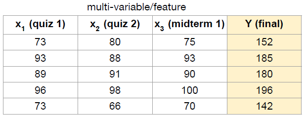
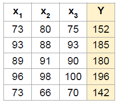

# Industry 4.0 의 중심, BigData

<div align='right'><font size=2 color='gray'>Data Processing Based Python @ <font color='blue'><a href='https://www.facebook.com/jskim.kr'>FB / jskim.kr</a></font>, [김진수](bigpycraft@gmail.com)</font></div>
<hr>

## Sect4. Multi-variable linear regression


```python
from images import bigpycraft_copy as bpc
```

### <font color='brown'>Ex01. Multi-variable linear regression</font>

### Predictin exam score
> regression using three inputs (x1, x2, x3)


```python
# Test Scores for General Psychology
bpc.Figure(bpc.ML04_IMG_01, 500)
```





```python
bpc.ML04_IMG_01
```


    'images/lab04_1_regression_using_3input.png'


### Hypothesis
> 
<br>
$$ H(x) = Wx + b $$
<br>
$$ H(x1, x2, x3) = w1 x1 + w2 x2 + w3 x3 + b $$

### Cost function
> 
<br>
$$ H(x1, x2, x3) = w1 x1 + w2 x2 + w3 x3 + b $$
<br>
$$ cost(W,b) = \frac{1}{m} \sum^m_{i=1}(H(x1^{(i)}, x2^{(i)}, x3^{(i)} )-y^{(i)})^2 $$


```python
import tensorflow as tf

tf.set_random_seed(777)  # for reproducibility

x1_data = [73., 93., 89., 96., 73.]
x2_data = [80., 88., 91., 98., 66.]
x3_data = [75., 93., 90., 100., 70.]

y_data = [152., 185., 180., 196., 142.]

# placeholders for a tensor that will be always fed.
x1 = tf.placeholder(tf.float32)
x2 = tf.placeholder(tf.float32)
x3 = tf.placeholder(tf.float32)

Y = tf.placeholder(tf.float32)

w1 = tf.Variable(tf.random_normal([1]), name='weight1')
w2 = tf.Variable(tf.random_normal([1]), name='weight2')
w3 = tf.Variable(tf.random_normal([1]), name='weight3')
b  = tf.Variable(tf.random_normal([1]), name='bias')

hypothesis = x1 * w1 + x2 * w2 + x3 * w3 + b
print(hypothesis)

# cost/loss function
cost = tf.reduce_mean(tf.square(hypothesis - Y))

# Minimize. Need a very small learning rate for this data set
optimizer = tf.train.GradientDescentOptimizer(learning_rate=1e-5)
train = optimizer.minimize(cost)

```

    Tensor("add_2:0", dtype=float32)
    


```python
# Launch the graph in a session.
sess = tf.Session()

# Initializes global variables in the graph.
sess.run(tf.global_variables_initializer())

for step in range(2001):
    cost_val, hy_val, _ = sess.run([cost, hypothesis, train],
                                   feed_dict={x1: x1_data, x2: x2_data, x3: x3_data, Y: y_data})

    if step % 100 == 0 or step < 10 :
        print("\nStep : {} \nCost : {} \nPrediction :\n{}".format(step, cost_val, hy_val))

```

    
    Step : 0 
    Cost : 62547.2890625 
    Prediction :
    [-75.96344757 -78.27629089 -83.83014679 -90.80435944 -56.97648239]
    
    Step : 1 
    Cost : 19614.837890625 
    Prediction :
    [ 21.69748688  39.10213089  31.82624626  35.14236832  32.55316544]
    
    Step : 2 
    Cost : 6157.78662109375 
    Prediction :
    [  76.37489319  104.81756592   96.57820129  105.65544891   82.67695618]
    
    Step : 3 
    Cost : 1939.7125244140625 
    Prediction :
    [ 106.98739624  141.60879517  132.8306427   145.13327026  110.73886108]
    
    Step : 4 
    Cost : 617.5654907226562 
    Prediction :
    [ 124.12684631  162.20640564  153.12724304  167.23558044  126.44911957]
    
    Step : 5 
    Cost : 203.13729858398438 
    Prediction :
    [ 133.72323608  173.73782349  164.49076843  179.61000061  135.24415588]
    
    Step : 6 
    Cost : 73.23114013671875 
    Prediction :
    [ 139.09654236  180.19340515  170.85298157  186.5381012   140.16760254]
    
    Step : 7 
    Cost : 32.50749206542969 
    Prediction :
    [ 142.10548401  183.8072052   174.41511536  190.41703796  142.92350769]
    
    Step : 8 
    Cost : 19.737699508666992 
    Prediction :
    [ 143.79071045  185.82998657  176.40963745  192.58882141  144.46583557]
    
    Step : 9 
    Cost : 15.729873657226562 
    Prediction :
    [ 144.73486328  186.96206665  177.52651978  193.80490112  145.32879639]
    
    Step : 100 
    Cost : 13.247166633605957 
    Prediction :
    [ 146.06376648  188.31446838  178.98654175  195.37893677  146.31259155]
    
    Step : 200 
    Cost : 12.562139511108398 
    Prediction :
    [ 146.20278931  188.21931458  179.02929688  195.40849304  146.18890381]
    
    Step : 300 
    Cost : 11.913301467895508 
    Prediction :
    [ 146.33810425  188.12670898  179.07095337  195.43722534  146.068573  ]
    
    Step : 400 
    Cost : 11.2986478805542 
    Prediction :
    [ 146.4697876   188.0365448   179.11146545  195.46513367  145.95143127]
    
    Step : 500 
    Cost : 10.716390609741211 
    Prediction :
    [ 146.59799194  187.94880676  179.15092468  195.49230957  145.83746338]
    
    Step : 600 
    Cost : 10.164864540100098 
    Prediction :
    [ 146.72277832  187.86341858  179.18934631  195.51869202  145.7265625 ]
    
    Step : 700 
    Cost : 9.64239501953125 
    Prediction :
    [ 146.84423828  187.7802887   179.22673035  195.5443573   145.61863708]
    
    Step : 800 
    Cost : 9.14744758605957 
    Prediction :
    [ 146.96247864  187.69937134  179.26315308  195.56930542  145.5136261 ]
    
    Step : 900 
    Cost : 8.678604125976562 
    Prediction :
    [ 147.07757568  187.62060547  179.29858398  195.59356689  145.41145325]
    
    Step : 1000 
    Cost : 8.234463691711426 
    Prediction :
    [ 147.18960571  187.54394531  179.33308411  195.61715698  145.31201172]
    
    Step : 1100 
    Cost : 7.813770294189453 
    Prediction :
    [ 147.29864502  187.46932983  179.3666687   195.64007568  145.21525574]
    
    Step : 1200 
    Cost : 7.4152069091796875 
    Prediction :
    [ 147.40480042  187.39668274  179.39936829  195.66235352  145.12110901]
    
    Step : 1300 
    Cost : 7.037703037261963 
    Prediction :
    [ 147.50811768  187.32600403  179.43121338  195.68400574  145.02949524]
    
    Step : 1400 
    Cost : 6.680026054382324 
    Prediction :
    [ 147.60870361  187.25717163  179.46218872  195.70504761  144.94033813]
    
    Step : 1500 
    Cost : 6.341263771057129 
    Prediction :
    [ 147.706604    187.19020081  179.49237061  195.72554016  144.85360718]
    
    Step : 1600 
    Cost : 6.020312786102295 
    Prediction :
    [ 147.8019104   187.125       179.52174377  195.74542236  144.76919556]
    
    Step : 1700 
    Cost : 5.716288089752197 
    Prediction :
    [ 147.89468384  187.06155396  179.55033875  195.76475525  144.6870575 ]
    
    Step : 1800 
    Cost : 5.4283013343811035 
    Prediction :
    [ 147.98498535  186.99977112  179.57818604  195.78353882  144.60716248]
    
    Step : 1900 
    Cost : 5.155463695526123 
    Prediction :
    [ 148.07289124  186.93965149  179.60528564  195.80180359  144.52938843]
    
    Step : 2000 
    Cost : 4.897013187408447 
    Prediction :
    [ 148.15846252  186.88111877  179.63166809  195.81954956  144.45373535]
    
<!--
# ? sess.run
'''
Signature: sess.run(fetches, feed_dict=None, options=None, run_metadata=None)
Docstring:
Runs operations and evaluates tensors in `fetches`.

Args:
  fetches: A single graph element, a list of graph elements,
    or a dictionary whose values are graph elements or lists of graph
    elements (described above).
  feed_dict: A dictionary that maps graph elements to values
    (described above).
  options: A [`RunOptions`] protocol buffer
  run_metadata: A [`RunMetadata`] protocol buffer

Returns:
  Either a single value if `fetches` is a single graph element, or
  a list of values if `fetches` is a list, or a dictionary with the
  same keys as `fetches` if that is a dictionary (described above)
  
'''
-->

```python
from tqdm import tqdm_notebook

# Launch the graph in a session.
sess = tf.Session()

# Initializes global variables in the graph.
sess.run(tf.global_variables_initializer())

for step in tqdm_notebook(range(2001)):
    cost_val, hy_val, _ = sess.run([cost, hypothesis, train],
                                   feed_dict={x1: x1_data, x2: x2_data, x3: x3_data, Y: y_data})

    if step % 100 == 0 or step < 10 :
        print("\nStep : {} \nCost : {} \nPrediction :\n{}".format(step, cost_val, hy_val))

        
```


    A Jupyter Widget


    
    Step : 0 
    Cost : 62547.2890625 
    Prediction :
    [-75.96344757 -78.27629089 -83.83014679 -90.80435944 -56.97648239]
    
    Step : 1 
    Cost : 19614.837890625 
    Prediction :
    [ 21.69748688  39.10213089  31.82624626  35.14236832  32.55316544]
    
    Step : 2 
    Cost : 6157.78662109375 
    Prediction :
    [  76.37489319  104.81756592   96.57820129  105.65544891   82.67695618]
    
    Step : 3 
    Cost : 1939.7125244140625 
    Prediction :
    [ 106.98739624  141.60879517  132.8306427   145.13327026  110.73886108]
    
    Step : 4 
    Cost : 617.5654907226562 
    Prediction :
    [ 124.12684631  162.20640564  153.12724304  167.23558044  126.44911957]
    
    Step : 5 
    Cost : 203.13729858398438 
    Prediction :
    [ 133.72323608  173.73782349  164.49076843  179.61000061  135.24415588]
    
    Step : 6 
    Cost : 73.23114013671875 
    Prediction :
    [ 139.09654236  180.19340515  170.85298157  186.5381012   140.16760254]
    
    Step : 7 
    Cost : 32.50749206542969 
    Prediction :
    [ 142.10548401  183.8072052   174.41511536  190.41703796  142.92350769]
    
    Step : 8 
    Cost : 19.737699508666992 
    Prediction :
    [ 143.79071045  185.82998657  176.40963745  192.58882141  144.46583557]
    
    Step : 9 
    Cost : 15.729873657226562 
    Prediction :
    [ 144.73486328  186.96206665  177.52651978  193.80490112  145.32879639]
    
    Step : 100 
    Cost : 13.247166633605957 
    Prediction :
    [ 146.06376648  188.31446838  178.98654175  195.37893677  146.31259155]
    
    Step : 200 
    Cost : 12.562139511108398 
    Prediction :
    [ 146.20278931  188.21931458  179.02929688  195.40849304  146.18890381]
    
    Step : 300 
    Cost : 11.913301467895508 
    Prediction :
    [ 146.33810425  188.12670898  179.07095337  195.43722534  146.068573  ]
    
    Step : 400 
    Cost : 11.2986478805542 
    Prediction :
    [ 146.4697876   188.0365448   179.11146545  195.46513367  145.95143127]
    
    Step : 500 
    Cost : 10.716390609741211 
    Prediction :
    [ 146.59799194  187.94880676  179.15092468  195.49230957  145.83746338]
    
    Step : 600 
    Cost : 10.164864540100098 
    Prediction :
    [ 146.72277832  187.86341858  179.18934631  195.51869202  145.7265625 ]
    
    Step : 700 
    Cost : 9.64239501953125 
    Prediction :
    [ 146.84423828  187.7802887   179.22673035  195.5443573   145.61863708]
    
    Step : 800 
    Cost : 9.14744758605957 
    Prediction :
    [ 146.96247864  187.69937134  179.26315308  195.56930542  145.5136261 ]
    
    Step : 900 
    Cost : 8.678604125976562 
    Prediction :
    [ 147.07757568  187.62060547  179.29858398  195.59356689  145.41145325]
    
    Step : 1000 
    Cost : 8.234463691711426 
    Prediction :
    [ 147.18960571  187.54394531  179.33308411  195.61715698  145.31201172]
    
    Step : 1100 
    Cost : 7.813770294189453 
    Prediction :
    [ 147.29864502  187.46932983  179.3666687   195.64007568  145.21525574]
    
    Step : 1200 
    Cost : 7.4152069091796875 
    Prediction :
    [ 147.40480042  187.39668274  179.39936829  195.66235352  145.12110901]
    
    Step : 1300 
    Cost : 7.037703037261963 
    Prediction :
    [ 147.50811768  187.32600403  179.43121338  195.68400574  145.02949524]
    
    Step : 1400 
    Cost : 6.680026054382324 
    Prediction :
    [ 147.60870361  187.25717163  179.46218872  195.70504761  144.94033813]
    
    Step : 1500 
    Cost : 6.341263771057129 
    Prediction :
    [ 147.706604    187.19020081  179.49237061  195.72554016  144.85360718]
    
    Step : 1600 
    Cost : 6.020312786102295 
    Prediction :
    [ 147.8019104   187.125       179.52174377  195.74542236  144.76919556]
    
    Step : 1700 
    Cost : 5.716288089752197 
    Prediction :
    [ 147.89468384  187.06155396  179.55033875  195.76475525  144.6870575 ]
    
    Step : 1800 
    Cost : 5.4283013343811035 
    Prediction :
    [ 147.98498535  186.99977112  179.57818604  195.78353882  144.60716248]
    
    Step : 1900 
    Cost : 5.155463695526123 
    Prediction :
    [ 148.07289124  186.93965149  179.60528564  195.80180359  144.52938843]
    
    Step : 2000 
    Cost : 4.897013187408447 
    Prediction :
    [ 148.15846252  186.88111877  179.63166809  195.81954956  144.45373535]
    
    

### <font color='brown'>Ex02. Multi-variable matmul linear regression</font>


```python
# Test Scores for General Psychology
bpc.Figure(bpc.ML04_IMG_02, 250)
```





### Hypothesis using matrix
> 
$$ w1 x1 + w2 x2 + w3 x3 + ... + wn xn $$
<br>
> 
$$
[x_{1}  x_{2}  x_{3}] \times
\begin{bmatrix}
    w_{1}\\
    w_{2}\\
    w_{3}
\end{bmatrix}
=
[x_1 w_1 + x_2 w_2 + x_3 w_3]
$$
<br>
> 
$$H(X) = XW$$


```python
import tensorflow as tf
tf.set_random_seed(777)  # for reproducibility

x_data = [[73., 80., 75.], 
          [93., 88., 93.],
          [89., 91., 90.], 
          [96., 98., 100.], 
          [73., 66., 70.]]
y_data = [[152.], [185.], [180.], [196.], [142.]]


# placeholders for a tensor that will be always fed.
X = tf.placeholder(tf.float32, shape=[None, 3])
Y = tf.placeholder(tf.float32, shape=[None, 1])

W = tf.Variable(tf.random_normal([3, 1]), name='weight')
b = tf.Variable(tf.random_normal([1]), name='bias')

# Hypothesis
hypothesis = tf.matmul(X, W) + b

# Simplified cost/loss function
cost = tf.reduce_mean(tf.square(hypothesis - Y))

# Minimize
optimizer = tf.train.GradientDescentOptimizer(learning_rate=1e-5)
train = optimizer.minimize(cost)

```


```python
# Launch the graph in a session.
sess = tf.Session()

# Initializes global variables in the graph.
sess.run(tf.global_variables_initializer())

for step in range(2001):
    cost_val, hy_val, _ = sess.run(
        [cost, hypothesis, train], feed_dict={X: x_data, Y: y_data})

    if step % 100 == 0 or step < 10 :
        print("\nStep : {} \nCost : {} \nPrediction :\n{}".format(step, cost_val, hy_val))

```

    
    Step : 0 
    Cost : 6796.61083984375 
    Prediction :
    [[  78.87274933]
     [  96.46897888]
     [  94.26753235]
     [ 101.00260162]
     [  75.49320221]]
    
    Step : 1 
    Cost : 2130.64013671875 
    Prediction :
    [[ 111.06803894]
     [ 135.16534424]
     [ 132.39570618]
     [ 142.52323914]
     [ 105.00878143]]
    
    Step : 2 
    Cost : 668.1067504882812 
    Prediction :
    [[ 129.0929718 ]
     [ 156.83001709]
     [ 153.74224854]
     [ 165.76913452]
     [ 121.53346252]]
    
    Step : 3 
    Cost : 209.6794891357422 
    Prediction :
    [[ 139.18449402]
     [ 168.95930481]
     [ 165.69342041]
     [ 178.78366089]
     [ 130.78501892]]
    
    Step : 4 
    Cost : 65.98698425292969 
    Prediction :
    [[ 144.83435059]
     [ 175.75003052]
     [ 172.38442993]
     [ 186.0700531 ]
     [ 135.96463013]]
    
    Step : 5 
    Cost : 20.947214126586914 
    Prediction :
    [[ 147.99746704]
     [ 179.5519104 ]
     [ 176.13046265]
     [ 190.14941406]
     [ 138.86448669]]
    
    Step : 6 
    Cost : 6.829581260681152 
    Prediction :
    [[ 149.7684021 ]
     [ 181.68043518]
     [ 178.22772217]
     [ 192.43330383]
     [ 140.48802185]]
    
    Step : 7 
    Cost : 2.404451608657837 
    Prediction :
    [[ 150.75984192]
     [ 182.87213135]
     [ 179.40190125]
     [ 193.7119751 ]
     [ 141.3969574 ]]
    
    Step : 8 
    Cost : 1.0173604488372803 
    Prediction :
    [[ 151.31491089]
     [ 183.53933716]
     [ 180.0592804 ]
     [ 194.42788696]
     [ 141.90583801]]
    
    Step : 9 
    Cost : 0.5825842618942261 
    Prediction :
    [[ 151.62568665]
     [ 183.91287231]
     [ 180.42732239]
     [ 194.82868958]
     [ 142.19076538]]
    
    Step : 100 
    Cost : 0.38304275274276733 
    Prediction :
    [[ 152.01933289]
     [ 184.38896179]
     [ 180.89471436]
     [ 195.34004211]
     [ 142.55264282]]
    
    Step : 200 
    Cost : 0.3819039463996887 
    Prediction :
    [[ 152.01754761]
     [ 184.38996887]
     [ 180.89385986]
     [ 195.34172058]
     [ 142.55204773]]
    
    Step : 300 
    Cost : 0.38076919317245483 
    Prediction :
    [[ 152.01573181]
     [ 184.39096069]
     [ 180.89300537]
     [ 195.34338379]
     [ 142.55142212]]
    
    Step : 400 
    Cost : 0.3796361982822418 
    Prediction :
    [[ 152.01397705]
     [ 184.39195251]
     [ 180.89216614]
     [ 195.34506226]
     [ 142.55078125]]
    
    Step : 500 
    Cost : 0.37852686643600464 
    Prediction :
    [[ 152.01222229]
     [ 184.39289856]
     [ 180.89134216]
     [ 195.34672546]
     [ 142.55014038]]
    
    Step : 600 
    Cost : 0.3774069547653198 
    Prediction :
    [[ 152.01052856]
     [ 184.3938446 ]
     [ 180.89051819]
     [ 195.34840393]
     [ 142.54945374]]
    
    Step : 700 
    Cost : 0.37630289793014526 
    Prediction :
    [[ 152.00883484]
     [ 184.39476013]
     [ 180.88970947]
     [ 195.3500824 ]
     [ 142.54876709]]
    
    Step : 800 
    Cost : 0.3751949667930603 
    Prediction :
    [[ 152.00717163]
     [ 184.39569092]
     [ 180.88890076]
     [ 195.35176086]
     [ 142.54806519]]
    
    Step : 900 
    Cost : 0.3740999102592468 
    Prediction :
    [[ 152.00552368]
     [ 184.39657593]
     [ 180.8881073 ]
     [ 195.35343933]
     [ 142.54733276]]
    
    Step : 1000 
    Cost : 0.3730035722255707 
    Prediction :
    [[ 152.00389099]
     [ 184.3974762 ]
     [ 180.88731384]
     [ 195.35513306]
     [ 142.5466156 ]]
    
    Step : 1100 
    Cost : 0.3719133734703064 
    Prediction :
    [[ 152.00227356]
     [ 184.39834595]
     [ 180.88650513]
     [ 195.35679626]
     [ 142.54586792]]
    
    Step : 1200 
    Cost : 0.37083786725997925 
    Prediction :
    [[ 152.00068665]
     [ 184.3992157 ]
     [ 180.88574219]
     [ 195.35848999]
     [ 142.5451355 ]]
    
    Step : 1300 
    Cost : 0.3697700500488281 
    Prediction :
    [[ 151.99911499]
     [ 184.40007019]
     [ 180.88497925]
     [ 195.3601532 ]
     [ 142.54437256]]
    
    Step : 1400 
    Cost : 0.3687012195587158 
    Prediction :
    [[ 151.99754333]
     [ 184.40092468]
     [ 180.88421631]
     [ 195.36183167]
     [ 142.54360962]]
    
    Step : 1500 
    Cost : 0.36763516068458557 
    Prediction :
    [[ 151.9960022 ]
     [ 184.40177917]
     [ 180.88345337]
     [ 195.36351013]
     [ 142.54284668]]
    
    Step : 1600 
    Cost : 0.3665837347507477 
    Prediction :
    [[ 151.99446106]
     [ 184.40260315]
     [ 180.88269043]
     [ 195.36515808]
     [ 142.54206848]]
    
    Step : 1700 
    Cost : 0.3655323386192322 
    Prediction :
    [[ 151.9929657 ]
     [ 184.40341187]
     [ 180.88194275]
     [ 195.36685181]
     [ 142.54129028]]
    
    Step : 1800 
    Cost : 0.36448556184768677 
    Prediction :
    [[ 151.99142456]
     [ 184.40422058]
     [ 180.88119507]
     [ 195.36849976]
     [ 142.54046631]]
    
    Step : 1900 
    Cost : 0.363444060087204 
    Prediction :
    [[ 151.98994446]
     [ 184.4050293 ]
     [ 180.88044739]
     [ 195.37016296]
     [ 142.53967285]]
    
    Step : 2000 
    Cost : 0.3624166250228882 
    Prediction :
    [[ 151.98847961]
     [ 184.40579224]
     [ 180.87969971]
     [ 195.37181091]
     [ 142.53886414]]
    

### <font color='brown'>Ex03. File input linear regression</font>

### Loading Data File


```python
import tensorflow as tf
import numpy as np

tf.set_random_seed(777)  # for reproducibility

xy = np.loadtxt('./data/data-01-test-score.csv', delimiter=',', dtype=np.float32)
x_data = xy[:, 0:-1]
y_data = xy[:, [-1]]

# Make sure the shape and data are OK
print("x_data.shape : {}, \tlen(x_data) : {} \nx_data : \n{}".format(x_data.shape, len(x_data), x_data))
print("-"*25)
print("y_data.shape : {}  \ny_data : \n{}".format(y_data.shape, y_data))

# placeholders for a tensor that will be always fed.
X = tf.placeholder(tf.float32, shape=[None, 3])
Y = tf.placeholder(tf.float32, shape=[None, 1])

W = tf.Variable(tf.random_normal([3, 1]), name='weight')
b = tf.Variable(tf.random_normal([1]), name='bias')

# Hypothesis
hypothesis = tf.matmul(X, W) + b

# Simplified cost/loss function
cost = tf.reduce_mean(tf.square(hypothesis - Y))

# Minimize
optimizer = tf.train.GradientDescentOptimizer(learning_rate=1e-5)
train = optimizer.minimize(cost)

```

    x_data.shape : (25, 3), 	len(x_data) : 25 
    x_data : 
    [[  73.   80.   75.]
     [  93.   88.   93.]
     [  89.   91.   90.]
     [  96.   98.  100.]
     [  73.   66.   70.]
     [  53.   46.   55.]
     [  69.   74.   77.]
     [  47.   56.   60.]
     [  87.   79.   90.]
     [  79.   70.   88.]
     [  69.   70.   73.]
     [  70.   65.   74.]
     [  93.   95.   91.]
     [  79.   80.   73.]
     [  70.   73.   78.]
     [  93.   89.   96.]
     [  78.   75.   68.]
     [  81.   90.   93.]
     [  88.   92.   86.]
     [  78.   83.   77.]
     [  82.   86.   90.]
     [  86.   82.   89.]
     [  78.   83.   85.]
     [  76.   83.   71.]
     [  96.   93.   95.]]
    -------------------------
    y_data.shape : (25, 1)  
    y_data : 
    [[ 152.]
     [ 185.]
     [ 180.]
     [ 196.]
     [ 142.]
     [ 101.]
     [ 149.]
     [ 115.]
     [ 175.]
     [ 164.]
     [ 141.]
     [ 141.]
     [ 184.]
     [ 152.]
     [ 148.]
     [ 192.]
     [ 147.]
     [ 183.]
     [ 177.]
     [ 159.]
     [ 177.]
     [ 175.]
     [ 175.]
     [ 149.]
     [ 192.]]
    


```python
# Launch the graph in a session.
sess = tf.Session()
# Initializes global variables in the graph.
sess.run(tf.global_variables_initializer())

for step in range(2001):
    cost_val, hy_val, _ = sess.run(
        [cost, hypothesis, train], feed_dict={X: x_data, Y: y_data})

    if step % 100 == 0 or step < 10 :
        print("\nStep : {} \nCost : {} \nPrediction :\n{}".format(step, cost_val, hy_val))
        
```

    
    Step : 0 
    Cost : 19747.556640625 
    Prediction :
    [[ 19.02452278]
     [ 27.27049637]
     [ 24.58597946]
     [ 28.39909172]
     [ 20.2902813 ]
     [ 17.45678139]
     [ 22.03279686]
     [ 17.40878105]
     [ 28.21904945]
     [ 29.76410294]
     [ 20.86707497]
     [ 22.97251701]
     [ 23.96472359]
     [ 17.82900238]
     [ 22.92805672]
     [ 28.74987984]
     [ 16.37310791]
     [ 26.68054771]
     [ 21.90879059]
     [ 19.29853058]
     [ 26.10753822]
     [ 26.7186985 ]
     [ 24.05034256]
     [ 15.73719597]
     [ 26.9419384 ]]
    
    Step : 1 
    Cost : 7306.12255859375 
    Prediction :
    [[ 70.80254364]
     [ 89.50184631]
     [ 85.90409851]
     [ 95.1789856 ]
     [ 67.75171661]
     [ 52.44775009]
     [ 72.01989746]
     [ 54.4662323 ]
     [ 86.37819672]
     [ 83.63311005]
     [ 69.02693939]
     [ 70.45862579]
     [ 87.31499481]
     [ 70.49182129]
     [ 73.14474487]
     [ 91.89998627]
     [ 66.52742767]
     [ 86.67008209]
     [ 82.30440521]
     [ 73.33829498]
     [ 84.7252655 ]
     [ 85.09992981]
     [ 79.93787384]
     [ 67.9422226 ]
     [ 91.43778992]]
    
    Step : 2 
    Cost : 2706.17822265625 
    Prediction :
    [[ 102.28653717]
     [ 127.3416214 ]
     [ 123.18880463]
     [ 135.78469849]
     [  96.61057281]
     [  73.72382355]
     [ 102.41475677]
     [  76.99924469]
     [ 121.74169159]
     [ 116.38784027]
     [  98.31066132]
     [  99.33245087]
     [ 125.83541107]
     [ 102.51373291]
     [ 103.67914581]
     [ 130.29837036]
     [  97.02396393]
     [ 123.14702606]
     [ 119.02831268]
     [ 106.1975174 ]
     [ 120.36795807]
     [ 120.59861755]
     [ 113.92050934]
     [  99.68596649]
     [ 130.65457153]]
    
    Step : 3 
    Cost : 1005.450927734375 
    Prediction :
    [[ 121.43069458]
     [ 150.3500061 ]
     [ 145.85993958]
     [ 160.47512817]
     [ 114.15808105]
     [  86.66051483]
     [ 120.896492  ]
     [  90.70063019]
     [ 143.24423218]
     [ 136.3039856 ]
     [ 116.11668396]
     [ 116.88900757]
     [ 149.25796509]
     [ 121.98487854]
     [ 122.24565125]
     [ 153.64645386]
     [ 115.56751251]
     [ 145.32707214]
     [ 141.35856628]
     [ 126.1778717 ]
     [ 142.0406189 ]
     [ 142.1835022 ]
     [ 134.58383179]
     [ 118.98817444]
     [ 154.50036621]]
    
    Step : 4 
    Cost : 376.6444091796875 
    Prediction :
    [[ 133.07157898]
     [ 164.34016418]
     [ 159.64526367]
     [ 175.48823547]
     [ 124.82767487]
     [  94.52642059]
     [ 132.13442993]
     [  99.03191376]
     [ 156.31858826]
     [ 148.41358948]
     [ 126.94367218]
     [ 127.56409454]
     [ 163.50022888]
     [ 133.82450867]
     [ 133.53504944]
     [ 167.84312439]
     [ 126.84302521]
     [ 158.81385803]
     [ 154.9367218 ]
     [ 138.32717896]
     [ 155.21878052]
     [ 155.30807495]
     [ 147.14830017]
     [ 130.7252655 ]
     [ 168.99980164]]
    
    Step : 5 
    Cost : 144.15692138671875 
    Prediction :
    [[ 140.15007019]
     [ 172.84672546]
     [ 168.0275116 ]
     [ 184.61700439]
     [ 131.31515503]
     [  99.30902863]
     [ 138.96772766]
     [ 104.09791565]
     [ 164.26815796]
     [ 155.77641296]
     [ 133.52702332]
     [ 134.05485535]
     [ 172.16038513]
     [ 141.02374268]
     [ 140.39958191]
     [ 176.4752655 ]
     [ 133.69917297]
     [ 167.01467896]
     [ 163.19313049]
     [ 145.71479797]
     [ 163.23179626]
     [ 163.28831482]
     [ 154.78822327]
     [ 137.86238098]
     [ 177.81610107]]
    
    Step : 6 
    Cost : 58.19843673706055 
    Prediction :
    [[ 144.45443726]
     [ 178.01902771]
     [ 173.12446594]
     [ 190.16784668]
     [ 135.25971985]
     [ 102.21685028]
     [ 143.12284851]
     [ 107.17844391]
     [ 169.10160828]
     [ 160.25297546]
     [ 137.53005981]
     [ 138.00138855]
     [ 177.42636108]
     [ 145.40144348]
     [ 144.5736084 ]
     [ 181.72392273]
     [ 137.86817932]
     [ 172.00138855]
     [ 168.21369934]
     [ 150.20710754]
     [ 168.10421753]
     [ 168.14057922]
     [ 159.43382263]
     [ 142.20249939]
     [ 183.17686462]]
    
    Step : 7 
    Cost : 26.416654586791992 
    Prediction :
    [[ 147.07192993]
     [ 181.16390991]
     [ 176.22375488]
     [ 193.5430603 ]
     [ 137.65802002]
     [ 103.98467255]
     [ 145.64944458]
     [ 109.05169678]
     [ 172.0402832 ]
     [ 162.9744873 ]
     [ 139.96408081]
     [ 140.40084839]
     [ 180.62846375]
     [ 148.06344604]
     [ 147.1116333 ]
     [ 184.91519165]
     [ 140.40318298]
     [ 175.03372192]
     [ 171.26663208]
     [ 152.93884277]
     [ 171.06692505]
     [ 171.09082031]
     [ 162.25866699]
     [ 144.84184265]
     [ 186.43637085]]
    
    Step : 8 
    Cost : 14.665279388427734 
    Prediction :
    [[ 148.66375732]
     [ 183.07597351]
     [ 178.10835266]
     [ 195.59538269]
     [ 139.11611938]
     [ 105.05932617]
     [ 147.18579102]
     [ 110.19086456]
     [ 173.826828  ]
     [ 164.62886047]
     [ 141.4440918 ]
     [ 141.85960388]
     [ 182.57563782]
     [ 149.6822052 ]
     [ 148.65486145]
     [ 186.85548401]
     [ 141.94465637]
     [ 176.87767029]
     [ 173.12315369]
     [ 154.60011292]
     [ 172.86843872]
     [ 172.88453674]
     [ 163.97639465]
     [ 146.44703674]
     [ 188.41825867]]
    
    Step : 9 
    Cost : 10.319557189941406 
    Prediction :
    [[ 149.63191223]
     [ 184.23847961]
     [ 179.25437927]
     [ 196.84338379]
     [ 140.00254822]
     [ 105.71250916]
     [ 148.12007141]
     [ 110.88368988]
     [ 174.91285706]
     [ 165.63438416]
     [ 142.34402466]
     [ 142.74641418]
     [ 183.75975037]
     [ 150.66670227]
     [ 149.59326172]
     [ 188.03512573]
     [ 142.88204956]
     [ 177.99909973]
     [ 174.2522583 ]
     [ 155.61047363]
     [ 173.96391296]
     [ 173.97506714]
     [ 165.02098083]
     [ 147.42346191]
     [ 189.62330627]]
    
    Step : 100 
    Cost : 7.658473968505859 
    Prediction :
    [[ 151.18777466]
     [ 186.00650024]
     [ 181.04997253]
     [ 198.78717041]
     [ 141.33526611]
     [ 106.66503143]
     [ 149.58625793]
     [ 111.98925018]
     [ 176.52719116]
     [ 167.09460449]
     [ 143.73825073]
     [ 144.07162476]
     [ 185.62501526]
     [ 152.2270813 ]
     [ 151.04963684]
     [ 189.82751465]
     [ 144.35067749]
     [ 179.77490234]
     [ 176.04808044]
     [ 157.22621155]
     [ 175.67277527]
     [ 175.6288147 ]
     [ 166.66223145]
     [ 149.01641846]
     [ 191.47717285]]
    
    Step : 200 
    Cost : 7.543206691741943 
    Prediction :
    [[ 151.24589539]
     [ 185.96812439]
     [ 181.06895447]
     [ 198.79563904]
     [ 141.28915405]
     [ 106.59949493]
     [ 149.60473633]
     [ 112.02318573]
     [ 176.45127869]
     [ 166.98756409]
     [ 143.73634338]
     [ 144.01728821]
     [ 185.65516663]
     [ 152.26226807]
     [ 151.0506897 ]
     [ 189.78694153]
     [ 144.36541748]
     [ 179.8144989 ]
     [ 176.09544373]
     [ 157.27809143]
     [ 175.68330383]
     [ 175.58781433]
     [ 166.68490601]
     [ 149.1002655 ]
     [ 191.46012878]]
    
    Step : 300 
    Cost : 7.4361653327941895 
    Prediction :
    [[ 151.30186462]
     [ 185.93101501]
     [ 181.08711243]
     [ 198.80384827]
     [ 141.24443054]
     [ 106.53644562]
     [ 149.62297058]
     [ 112.05665588]
     [ 176.3782196 ]
     [ 166.88499451]
     [ 143.73464966]
     [ 143.96511841]
     [ 185.68389893]
     [ 152.295578  ]
     [ 151.05210876]
     [ 189.74790955]
     [ 144.37876892]
     [ 179.85328674]
     [ 176.14073181]
     [ 157.32780457]
     [ 175.69380188]
     [ 175.54840088]
     [ 166.70707703]
     [ 149.18049622]
     [ 191.44346619]]
    
    Step : 400 
    Cost : 7.336749076843262 
    Prediction :
    [[ 151.35571289]
     [ 185.89508057]
     [ 181.10449219]
     [ 198.81182861]
     [ 141.20101929]
     [ 106.47575378]
     [ 149.6408844 ]
     [ 112.08964539]
     [ 176.30792236]
     [ 166.78665161]
     [ 143.7331543 ]
     [ 143.91500854]
     [ 185.71122742]
     [ 152.3270874 ]
     [ 151.05387878]
     [ 189.71034241]
     [ 144.39077759]
     [ 179.89126587]
     [ 176.184021  ]
     [ 157.37542725]
     [ 175.70428467]
     [ 175.51046753]
     [ 166.72869873]
     [ 149.25726318]
     [ 191.42715454]]
    
    Step : 500 
    Cost : 7.244378566741943 
    Prediction :
    [[ 151.40756226]
     [ 185.86035156]
     [ 181.12113953]
     [ 198.8196106 ]
     [ 141.15890503]
     [ 106.41736603]
     [ 149.65853882]
     [ 112.12215424]
     [ 176.24026489]
     [ 166.69244385]
     [ 143.73184204]
     [ 143.86691284]
     [ 185.73725891]
     [ 152.35690308]
     [ 151.0559845 ]
     [ 189.67419434]
     [ 144.40158081]
     [ 179.92845154]
     [ 176.22543335]
     [ 157.42111206]
     [ 175.7147522 ]
     [ 175.47401428]
     [ 166.74984741]
     [ 149.33071899]
     [ 191.41122437]]
    
    Step : 600 
    Cost : 7.158479690551758 
    Prediction :
    [[ 151.45747375]
     [ 185.82670593]
     [ 181.1370697 ]
     [ 198.82717896]
     [ 141.11802673]
     [ 106.36117554]
     [ 149.67591858]
     [ 112.15419006]
     [ 176.17515564]
     [ 166.60212708]
     [ 143.73069763]
     [ 143.82072449]
     [ 185.76202393]
     [ 152.38508606]
     [ 151.05836487]
     [ 189.63941956]
     [ 144.41122437]
     [ 179.96488953]
     [ 176.26501465]
     [ 157.46488953]
     [ 175.72518921]
     [ 175.43891907]
     [ 166.77052307]
     [ 149.40098572]
     [ 191.39564514]]
    
    Step : 700 
    Cost : 7.078627109527588 
    Prediction :
    [[ 151.50553894]
     [ 185.79414368]
     [ 181.15229797]
     [ 198.83451843]
     [ 141.07833862]
     [ 106.30706787]
     [ 149.69300842]
     [ 112.18572998]
     [ 176.11247253]
     [ 166.51554871]
     [ 143.72972107]
     [ 143.77635193]
     [ 185.78556824]
     [ 152.41172791]
     [ 151.06100464]
     [ 189.60594177]
     [ 144.41975403]
     [ 180.00050354]
     [ 176.30284119]
     [ 157.50682068]
     [ 175.73554993]
     [ 175.40515137]
     [ 166.79067993]
     [ 149.46821594]
     [ 191.38040161]]
    
    Step : 800 
    Cost : 7.004335880279541 
    Prediction :
    [[ 151.55180359]
     [ 185.76264954]
     [ 181.16687012]
     [ 198.8416748 ]
     [ 141.0398407 ]
     [ 106.25500488]
     [ 149.70982361]
     [ 112.21679688]
     [ 176.05213928]
     [ 166.43257141]
     [ 143.72889709]
     [ 143.73373413]
     [ 185.80799866]
     [ 152.43690491]
     [ 151.06391907]
     [ 189.57371521]
     [ 144.42726135]
     [ 180.03540039]
     [ 176.33900452]
     [ 157.54704285]
     [ 175.74588013]
     [ 175.37266541]
     [ 166.81039429]
     [ 149.532547  ]
     [ 191.36550903]]
    
    Step : 900 
    Cost : 6.935197353363037 
    Prediction :
    [[ 151.59638977]
     [ 185.73216248]
     [ 181.18083191]
     [ 198.84864807]
     [ 141.00245667]
     [ 106.20488739]
     [ 149.72634888]
     [ 112.24739075]
     [ 175.99406433]
     [ 166.3530426 ]
     [ 143.72821045]
     [ 143.6927948 ]
     [ 185.82933044]
     [ 152.4606781 ]
     [ 151.06706238]
     [ 189.54270935]
     [ 144.43379211]
     [ 180.06956482]
     [ 176.37361145]
     [ 157.58558655]
     [ 175.75614929]
     [ 175.34141541]
     [ 166.82965088]
     [ 149.59410095]
     [ 191.35096741]]
    
    Step : 1000 
    Cost : 6.8708367347717285 
    Prediction :
    [[ 151.63928223]
     [ 185.7026062 ]
     [ 181.19416809]
     [ 198.85539246]
     [ 140.96615601]
     [ 106.15662384]
     [ 149.74259949]
     [ 112.27745819]
     [ 175.93812561]
     [ 166.27677917]
     [ 143.72764587]
     [ 143.65345764]
     [ 185.84959412]
     [ 152.48312378]
     [ 151.07038879]
     [ 189.51283264]
     [ 144.43939209]
     [ 180.10298157]
     [ 176.40664673]
     [ 157.62251282]
     [ 175.7663269 ]
     [ 175.31132507]
     [ 166.84843445]
     [ 149.65296936]
     [ 191.3367157 ]]
    
    Step : 1100 
    Cost : 6.810900688171387 
    Prediction :
    [[ 151.6806488 ]
     [ 185.67405701]
     [ 181.20697021]
     [ 198.86201477]
     [ 140.93095398]
     [ 106.11016083]
     [ 149.7585907 ]
     [ 112.3070755 ]
     [ 175.88430786]
     [ 166.20370483]
     [ 143.72724915]
     [ 143.61572266]
     [ 185.86891174]
     [ 152.5043335 ]
     [ 151.07395935]
     [ 189.48410034]
     [ 144.44416809]
     [ 180.13572693]
     [ 176.43829346]
     [ 157.65795898]
     [ 175.776474  ]
     [ 175.28237915]
     [ 166.86682129]
     [ 149.70935059]
     [ 191.32284546]]
    
    Step : 1200 
    Cost : 6.755050182342529 
    Prediction :
    [[ 151.72045898]
     [ 185.64637756]
     [ 181.21920776]
     [ 198.86843872]
     [ 140.89674377]
     [ 106.06542206]
     [ 149.77429199]
     [ 112.3361969 ]
     [ 175.8324585 ]
     [ 166.13362122]
     [ 143.72694397]
     [ 143.579422  ]
     [ 185.88725281]
     [ 152.52430725]
     [ 151.07766724]
     [ 189.4564209 ]
     [ 144.44812012]
     [ 180.16773987]
     [ 176.4684906 ]
     [ 157.69190979]
     [ 175.78651428]
     [ 175.2545166 ]
     [ 166.88476562]
     [ 149.76324463]
     [ 191.30924988]]
    
    Step : 1300 
    Cost : 6.7030029296875 
    Prediction :
    [[ 151.75883484]
     [ 185.61956787]
     [ 181.23091125]
     [ 198.87466431]
     [ 140.86352539]
     [ 106.02233887]
     [ 149.78971863]
     [ 112.36483002]
     [ 175.78251648]
     [ 166.06643677]
     [ 143.72674561]
     [ 143.54455566]
     [ 185.9046936 ]
     [ 152.5431366 ]
     [ 151.08155823]
     [ 189.42977905]
     [ 144.4513092 ]
     [ 180.19906616]
     [ 176.49737549]
     [ 157.72445679]
     [ 175.79646301]
     [ 175.22769165]
     [ 166.90228271]
     [ 149.81483459]
     [ 191.29595947]]
    
    Step : 1400 
    Cost : 6.654475212097168 
    Prediction :
    [[ 151.79579163]
     [ 185.59362793]
     [ 181.24212646]
     [ 198.8807373 ]
     [ 140.83128357]
     [ 105.98085022]
     [ 149.80487061]
     [ 112.39299011]
     [ 175.73443604]
     [ 166.00204468]
     [ 143.72666931]
     [ 143.51104736]
     [ 185.92127991]
     [ 152.56088257]
     [ 151.08560181]
     [ 189.40411377]
     [ 144.45379639]
     [ 180.22973633]
     [ 176.52500916]
     [ 157.75567627]
     [ 175.80633545]
     [ 175.20188904]
     [ 166.91940308]
     [ 149.86419678]
     [ 191.2829895 ]]
    
    Step : 1500 
    Cost : 6.60922384262085 
    Prediction :
    [[ 151.83139038]
     [ 185.56848145]
     [ 181.25283813]
     [ 198.88665771]
     [ 140.79995728]
     [ 105.94087982]
     [ 149.81973267]
     [ 112.42066193]
     [ 175.68811035]
     [ 165.9402771 ]
     [ 143.72666931]
     [ 143.47885132]
     [ 185.93702698]
     [ 152.5776062 ]
     [ 151.0897522 ]
     [ 189.37937927]
     [ 144.45561218]
     [ 180.25971985]
     [ 176.5513916 ]
     [ 157.7855835 ]
     [ 175.81610107]
     [ 175.17701721]
     [ 166.93609619]
     [ 149.91140747]
     [ 191.27029419]]
    
    Step : 1600 
    Cost : 6.566984176635742 
    Prediction :
    [[ 151.8657074 ]
     [ 185.54414368]
     [ 181.2631073 ]
     [ 198.89241028]
     [ 140.76954651]
     [ 105.90236664]
     [ 149.83436584]
     [ 112.44784546]
     [ 175.64349365]
     [ 165.881073  ]
     [ 143.72676086]
     [ 143.44792175]
     [ 185.95201111]
     [ 152.59333801]
     [ 151.09403992]
     [ 189.35557556]
     [ 144.45681763]
     [ 180.28907776]
     [ 176.5766449 ]
     [ 157.81428528]
     [ 175.82575989]
     [ 175.15309143]
     [ 166.9524231 ]
     [ 149.95661926]
     [ 191.25791931]]
    
    Step : 1700 
    Cost : 6.527557373046875 
    Prediction :
    [[ 151.89878845]
     [ 185.52056885]
     [ 181.27294922]
     [ 198.897995  ]
     [ 140.74002075]
     [ 105.86529541]
     [ 149.84872437]
     [ 112.47457886]
     [ 175.6005249 ]
     [ 165.82429504]
     [ 143.72694397]
     [ 143.41818237]
     [ 185.96624756]
     [ 152.6081543 ]
     [ 151.09843445]
     [ 189.33265686]
     [ 144.45744324]
     [ 180.31777954]
     [ 176.6007843 ]
     [ 157.84179688]
     [ 175.83534241]
     [ 175.13005066]
     [ 166.96836853]
     [ 149.99986267]
     [ 191.24580383]]
    
    Step : 1800 
    Cost : 6.4907379150390625 
    Prediction :
    [[ 151.9306488 ]
     [ 185.49769592]
     [ 181.28233337]
     [ 198.90344238]
     [ 140.71131897]
     [ 105.82954407]
     [ 149.86279297]
     [ 112.50081635]
     [ 175.55909729]
     [ 165.76985168]
     [ 143.72718811]
     [ 143.38960266]
     [ 185.97975159]
     [ 152.62205505]
     [ 151.10289001]
     [ 189.31053162]
     [ 144.45750427]
     [ 180.34584045]
     [ 176.62382507]
     [ 157.86816406]
     [ 175.84480286]
     [ 175.10784912]
     [ 166.9839325 ]
     [ 150.04121399]
     [ 191.23396301]]
    
    Step : 1900 
    Cost : 6.456363677978516 
    Prediction :
    [[ 151.96138   ]
     [ 185.47558594]
     [ 181.29135132]
     [ 198.9087677 ]
     [ 140.68345642]
     [ 105.7951355 ]
     [ 149.87661743]
     [ 112.52659607]
     [ 175.51921082]
     [ 165.71763611]
     [ 143.72755432]
     [ 143.36213684]
     [ 185.99259949]
     [ 152.63514709]
     [ 151.10746765]
     [ 189.28926086]
     [ 144.45710754]
     [ 180.37333679]
     [ 176.64588928]
     [ 157.89347839]
     [ 175.85414124]
     [ 175.08648682]
     [ 166.99913025]
     [ 150.08082581]
     [ 191.22239685]]
    
    Step : 2000 
    Cost : 6.4242353439331055 
    Prediction :
    [[ 151.99098206]
     [ 185.45413208]
     [ 181.29997253]
     [ 198.91392517]
     [ 140.65638733]
     [ 105.76195526]
     [ 149.8901825 ]
     [ 112.55191803]
     [ 175.48075867]
     [ 165.66758728]
     [ 143.72793579]
     [ 143.33573914]
     [ 186.00479126]
     [ 152.64743042]
     [ 151.11210632]
     [ 189.26875305]
     [ 144.45619202]
     [ 180.40019226]
     [ 176.66696167]
     [ 157.91772461]
     [ 175.86338806]
     [ 175.06590271]
     [ 167.01396179]
     [ 150.11869812]
     [ 191.21110535]]
    


```python
# Launch the graph in a session.
sess = tf.Session()
# Initializes global variables in the graph.
sess.run(tf.global_variables_initializer())

for step in range(2001):
    cost_val, hy_val, _ = sess.run(
        [cost, hypothesis, train], feed_dict={X: x_data, Y: y_data})

    if step % 100 == 0 or step < 10 :
        # print("\nStep : {} \nCost : {} \nPrediction :\n{}".format(step, cost_val, hy_val))
        print("Step : {} \tCost : {} ".format(step, cost_val))
        
```

    Step : 0 	Cost : 19747.556640625 
    Step : 1 	Cost : 7306.12255859375 
    Step : 2 	Cost : 2706.17822265625 
    Step : 3 	Cost : 1005.450927734375 
    Step : 4 	Cost : 376.6444091796875 
    Step : 5 	Cost : 144.15692138671875 
    Step : 6 	Cost : 58.19843673706055 
    Step : 7 	Cost : 26.416654586791992 
    Step : 8 	Cost : 14.665279388427734 
    Step : 9 	Cost : 10.319557189941406 
    Step : 100 	Cost : 7.658473968505859 
    Step : 200 	Cost : 7.543206691741943 
    Step : 300 	Cost : 7.4361653327941895 
    Step : 400 	Cost : 7.336749076843262 
    Step : 500 	Cost : 7.244378566741943 
    Step : 600 	Cost : 7.158479690551758 
    Step : 700 	Cost : 7.078627109527588 
    Step : 800 	Cost : 7.004335880279541 
    Step : 900 	Cost : 6.935197353363037 
    Step : 1000 	Cost : 6.8708367347717285 
    Step : 1100 	Cost : 6.810900688171387 
    Step : 1200 	Cost : 6.755050182342529 
    Step : 1300 	Cost : 6.7030029296875 
    Step : 1400 	Cost : 6.654475212097168 
    Step : 1500 	Cost : 6.60922384262085 
    Step : 1600 	Cost : 6.566984176635742 
    Step : 1700 	Cost : 6.527557373046875 
    Step : 1800 	Cost : 6.4907379150390625 
    Step : 1900 	Cost : 6.456363677978516 
    Step : 2000 	Cost : 6.4242353439331055 
    


```python
# Ask my score
print("Your score \t: \n", sess.run(hypothesis, feed_dict={X: [[100, 70, 101]]}))

print("\nOther scores \t: \n", sess.run(hypothesis,
                                        feed_dict={X: [[60, 70, 110], [90, 100, 80]]}))

```

    Your score 	: 
     [[ 190.704422]]
    
    Other scores 	: 
     [[ 181.40220642]
     [ 174.0504303 ]]
    

### <font color='brown'>Ex04. TF reader linear regression 5</font>
> 
- 참조 : https://www.tensorflow.org/programmers_guide/reading_data


```python
import tensorflow as tf

tf.set_random_seed(777)  # for reproducibility

filename_queue = tf.train.string_input_producer(
    ['./data/data-01-test-score.csv'], shuffle=False, name='filename_queue')

reader = tf.TextLineReader()
key, value = reader.read(filename_queue)

# Default values, in case of empty columns. Also specifies the type of the
# decoded result.
record_defaults = [[0.], [0.], [0.], [0.]]
xy = tf.decode_csv(value, record_defaults=record_defaults)

# collect batches of csv in
train_x_batch, train_y_batch = \
    tf.train.batch([xy[0:-1], xy[-1:]], batch_size=10)

# placeholders for a tensor that will be always fed.
X = tf.placeholder(tf.float32, shape=[None, 3])
Y = tf.placeholder(tf.float32, shape=[None, 1])

W = tf.Variable(tf.random_normal([3, 1]), name='weight')
b = tf.Variable(tf.random_normal([1]), name='bias')

# Hypothesis
hypothesis = tf.matmul(X, W) + b

# Simplified cost/loss function
cost = tf.reduce_mean(tf.square(hypothesis - Y))

# Minimize
optimizer = tf.train.GradientDescentOptimizer(learning_rate=1e-5)
train = optimizer.minimize(cost)

```


```python
# Launch the graph in a session.
sess = tf.Session()
# Initializes global variables in the graph.
sess.run(tf.global_variables_initializer())

# Start populating the filename queue.
coord = tf.train.Coordinator()
threads = tf.train.start_queue_runners(sess=sess, coord=coord)

for step in range(2001):
    x_batch, y_batch = sess.run([train_x_batch, train_y_batch])
    cost_val, hy_val, _ = sess.run(
        [cost, hypothesis, train], feed_dict={X: x_batch, Y: y_batch})
    
    if step % 100 == 0 or step < 10 :
        print("\nStep : {} \nCost : {} \nPrediction :\n{}".format(step, cost_val, hy_val))

coord.request_stop()
coord.join(threads)

```

    
    Step : 0 
    Cost : 24236.328125 
    Prediction :
    [[-2.02125263]
     [ 6.76850414]
     [ 1.87698853]
     [ 1.28565133]
     [ 8.32792759]
     [ 6.54442692]
     [-2.36182117]
     [-6.78704262]
     [ 7.79308796]
     [ 6.70390034]]
    
    Step : 1 
    Cost : 10473.666015625 
    Prediction :
    [[ 52.8732872 ]
     [ 56.09102631]
     [ 70.61112976]
     [ 60.46385193]
     [ 52.79230881]
     [ 73.05446625]
     [ 61.36566162]
     [ 58.6218338 ]
     [ 66.0141983 ]
     [ 58.04776001]]
    
    Step : 2 
    Cost : 4369.697265625 
    Prediction :
    [[ 104.23686218]
     [ 110.38093567]
     [  98.82017517]
     [  93.87568665]
     [ 122.01331329]
     [  91.2566452 ]
     [ 118.90477753]
     [ 112.35327911]
     [ 121.60997772]
     [  93.85031128]]
    
    Step : 3 
    Cost : 982.099609375 
    Prediction :
    [[  86.94841766]
     [ 112.48291779]
     [  78.35535431]
     [ 141.42677307]
     [ 130.49452209]
     [ 111.89997101]
     [ 114.27536011]
     [ 148.27737427]
     [ 125.03739929]
     [ 114.33492279]]
    
    Step : 4 
    Cost : 770.8814697265625 
    Prediction :
    [[ 163.08157349]
     [ 132.88482666]
     [ 144.15429688]
     [ 152.13696289]
     [ 135.10879517]
     [ 145.0173645 ]
     [ 150.99559021]
     [ 137.70062256]
     [ 130.18678284]
     [ 166.87886047]]
    
    Step : 5 
    Cost : 169.37234497070312 
    Prediction :
    [[ 137.73258972]
     [ 174.75701904]
     [ 167.38920593]
     [ 181.54933167]
     [ 136.44400024]
     [ 101.01402283]
     [ 132.57936096]
     [  93.26013184]
     [ 164.80448914]
     [ 152.15454102]]
    
    Step : 6 
    Cost : 90.41606140136719 
    Prediction :
    [[ 135.14056396]
     [ 137.19262695]
     [ 178.8374939 ]
     [ 150.43571472]
     [ 138.57315063]
     [ 180.91801453]
     [ 147.04748535]
     [ 161.10702515]
     [ 169.19813538]
     [ 150.37541199]]
    
    Step : 7 
    Cost : 62.057586669921875 
    Prediction :
    [[ 164.83329773]
     [ 170.72436523]
     [ 156.59417725]
     [ 147.83270264]
     [ 188.67330933]
     [ 144.77914429]
     [ 183.22425842]
     [ 175.73306274]
     [ 190.63792419]
     [ 142.89988708]]
    
    Step : 8 
    Cost : 36.41782760620117 
    Prediction :
    [[ 107.28018951]
     [ 141.53671265]
     [  99.90575409]
     [ 175.22003174]
     [ 161.80526733]
     [ 139.88563538]
     [ 141.86962891]
     [ 185.07818604]
     [ 155.62261963]
     [ 143.52212524]]
    
    Step : 9 
    Cost : 61.64863967895508 
    Prediction :
    [[ 187.78775024]
     [ 152.49829102]
     [ 167.64154053]
     [ 175.76904297]
     [ 156.25569153]
     [ 167.96072388]
     [ 173.8359375 ]
     [ 159.57598877]
     [ 150.61482239]
     [ 192.10971069]]
    
    Step : 100 
    Cost : 32.52962112426758 
    Prediction :
    [[ 150.30389404]
     [ 189.68540955]
     [ 182.18743896]
     [ 197.71813965]
     [ 147.74102783]
     [ 109.40262604]
     [ 144.81115723]
     [ 102.5135498 ]
     [ 178.77816772]
     [ 165.1973114 ]]
    
    Step : 200 
    Cost : 31.149850845336914 
    Prediction :
    [[ 150.36990356]
     [ 189.57505798]
     [ 182.1721344 ]
     [ 197.75447083]
     [ 147.56596375]
     [ 109.33323669]
     [ 144.97050476]
     [ 102.82202911]
     [ 178.69587708]
     [ 165.22135925]]
    
    Step : 300 
    Cost : 29.83698081970215 
    Prediction :
    [[ 150.43493652]
     [ 189.46711731]
     [ 182.15745544]
     [ 197.78987122]
     [ 147.39497375]
     [ 109.26474762]
     [ 145.12571716]
     [ 103.12253571]
     [ 178.61463928]
     [ 165.24311829]]
    
    Step : 400 
    Cost : 28.587772369384766 
    Prediction :
    [[ 150.49894714]
     [ 189.36151123]
     [ 182.14337158]
     [ 197.82435608]
     [ 147.22793579]
     [ 109.19717407]
     [ 145.27688599]
     [ 103.41526794]
     [ 178.5344696 ]
     [ 165.26269531]]
    
    Step : 500 
    Cost : 27.399179458618164 
    Prediction :
    [[ 150.56193542]
     [ 189.25819397]
     [ 182.12986755]
     [ 197.85794067]
     [ 147.06480408]
     [ 109.13050842]
     [ 145.4241333 ]
     [ 103.70043945]
     [ 178.45541382]
     [ 165.28025818]]
    
    Step : 600 
    Cost : 26.268314361572266 
    Prediction :
    [[ 150.62391663]
     [ 189.15715027]
     [ 182.1169281 ]
     [ 197.89067078]
     [ 146.90545654]
     [ 109.06478882]
     [ 145.56756592]
     [ 103.9782486 ]
     [ 178.37747192]
     [ 165.29589844]]
    
    Step : 700 
    Cost : 25.19237518310547 
    Prediction :
    [[ 150.68489075]
     [ 189.05831909]
     [ 182.10452271]
     [ 197.92253113]
     [ 146.74983215]
     [ 109.        ]
     [ 145.70729065]
     [ 104.24889374]
     [ 178.3006897 ]
     [ 165.30975342]]
    
    Step : 800 
    Cost : 24.16869354248047 
    Prediction :
    [[ 150.74484253]
     [ 188.96165466]
     [ 182.09262085]
     [ 197.95359802]
     [ 146.59783936]
     [ 108.93617249]
     [ 145.84341431]
     [ 104.51257324]
     [ 178.2250061 ]
     [ 165.32189941]]
    
    Step : 900 
    Cost : 23.19475555419922 
    Prediction :
    [[ 150.80380249]
     [ 188.86712646]
     [ 182.08120728]
     [ 197.98384094]
     [ 146.4493866 ]
     [ 108.87327576]
     [ 145.97599792]
     [ 104.76945496]
     [ 178.15045166]
     [ 165.3324585 ]]
    
    Step : 1000 
    Cost : 22.26827621459961 
    Prediction :
    [[ 150.86175537]
     [ 188.77468872]
     [ 182.07028198]
     [ 198.01333618]
     [ 146.30441284]
     [ 108.81136322]
     [ 146.10516357]
     [ 105.01972961]
     [ 178.07707214]
     [ 165.34152222]]
    
    Step : 1100 
    Cost : 21.386844635009766 
    Prediction :
    [[ 150.91870117]
     [ 188.68429565]
     [ 182.05976868]
     [ 198.04203796]
     [ 146.1628418 ]
     [ 108.75039673]
     [ 146.23098755]
     [ 105.26357269]
     [ 178.00482178]
     [ 165.34919739]]
    
    Step : 1200 
    Cost : 20.54838752746582 
    Prediction :
    [[ 150.97467041]
     [ 188.59591675]
     [ 182.04972839]
     [ 198.07002258]
     [ 146.02461243]
     [ 108.69039154]
     [ 146.35357666]
     [ 105.50115204]
     [ 177.93373108]
     [ 165.35554504]]
    
    Step : 1300 
    Cost : 19.750774383544922 
    Prediction :
    [[ 151.02964783]
     [ 188.50950623]
     [ 182.04006958]
     [ 198.0973053 ]
     [ 145.88960266]
     [ 108.63134766]
     [ 146.47302246]
     [ 105.73262787]
     [ 177.86378479]
     [ 165.360672  ]]
    
    Step : 1400 
    Cost : 18.9920711517334 
    Prediction :
    [[ 151.08363342]
     [ 188.42501831]
     [ 182.03079224]
     [ 198.12387085]
     [ 145.75776672]
     [ 108.57327271]
     [ 146.58935547]
     [ 105.9581604 ]
     [ 177.79495239]
     [ 165.36462402]]
    
    Step : 1500 
    Cost : 18.270431518554688 
    Prediction :
    [[ 151.13667297]
     [ 188.34242249]
     [ 182.02191162]
     [ 198.1497345 ]
     [ 145.62905884]
     [ 108.51615906]
     [ 146.70271301]
     [ 106.17791748]
     [ 177.72731018]
     [ 165.36752319]]
    
    Step : 1600 
    Cost : 17.58401870727539 
    Prediction :
    [[ 151.1887207 ]
     [ 188.26170349]
     [ 182.01338196]
     [ 198.17497253]
     [ 145.50337219]
     [ 108.45999146]
     [ 146.81317139]
     [ 106.3920517 ]
     [ 177.66078186]
     [ 165.36940002]]
    
    Step : 1700 
    Cost : 16.931140899658203 
    Prediction :
    [[ 151.23980713]
     [ 188.18276978]
     [ 182.00518799]
     [ 198.19953918]
     [ 145.38061523]
     [ 108.40479279]
     [ 146.92076111]
     [ 106.60070801]
     [ 177.59539795]
     [ 165.37033081]]
    
    Step : 1800 
    Cost : 16.310230255126953 
    Prediction :
    [[ 151.28994751]
     [ 188.10562134]
     [ 181.99732971]
     [ 198.22348022]
     [ 145.26080322]
     [ 108.3505249 ]
     [ 147.02561951]
     [ 106.80401611]
     [ 177.53114319]
     [ 165.37039185]]
    
    Step : 1900 
    Cost : 15.719724655151367 
    Prediction :
    [[ 151.33917236]
     [ 188.03022766]
     [ 181.98979187]
     [ 198.24682617]
     [ 145.14379883]
     [ 108.29721832]
     [ 147.1277771 ]
     [ 107.00214386]
     [ 177.46801758]
     [ 165.36962891]]
    
    Step : 2000 
    Cost : 15.158185958862305 
    Prediction :
    [[ 151.38745117]
     [ 187.95654297]
     [ 181.98257446]
     [ 198.26956177]
     [ 145.02955627]
     [ 108.24485016]
     [ 147.22731018]
     [ 107.19519806]
     [ 177.40600586]
     [ 165.36810303]]
    


```python
# Ask my score
print("Your score \t: \n", sess.run(hypothesis, feed_dict={X: [[100, 70, 101]]}))

print("\nOther scores \t: \n", sess.run(hypothesis,
                                        feed_dict={X: [[60, 70, 110], [90, 100, 80]]}))
```

    Your score 	: 
     [[ 197.33753967]]
    
    Other scores 	: 
     [[ 159.75498962]
     [ 177.15989685]]
    

<hr>
<marquee><font size=3 color='brown'>The BigpyCraft find the information to design valuable society with Technology & Craft.</font></marquee>
<div align='right'><font size=2 color='gray'> &lt; The End &gt; </font></div>
